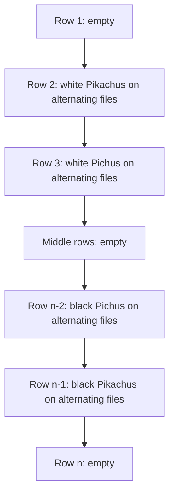
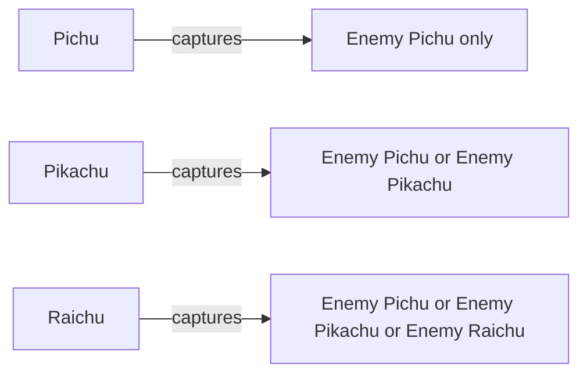
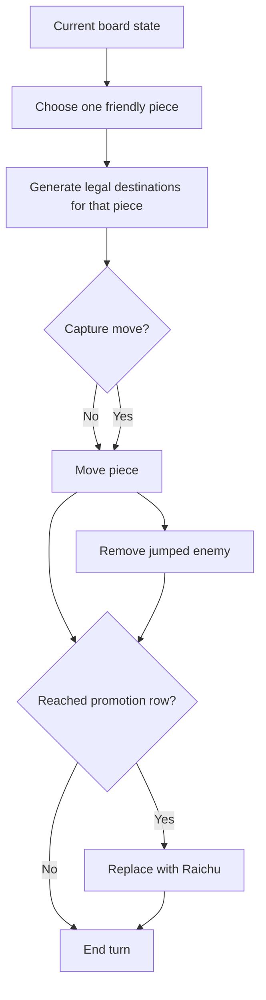
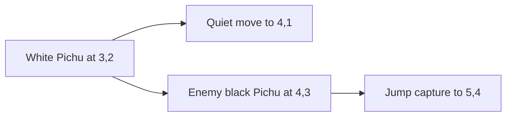
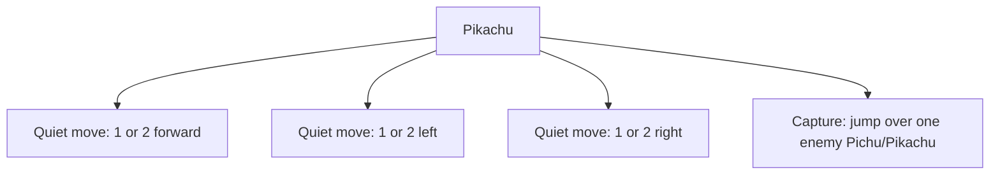
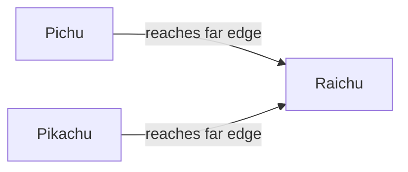
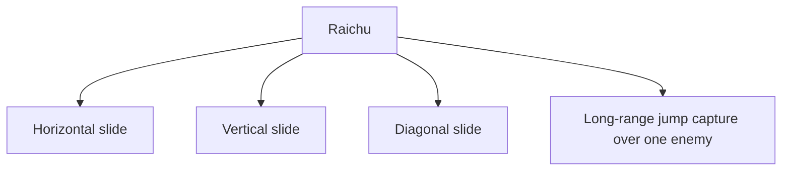
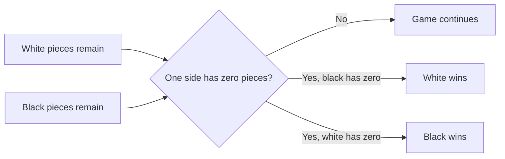
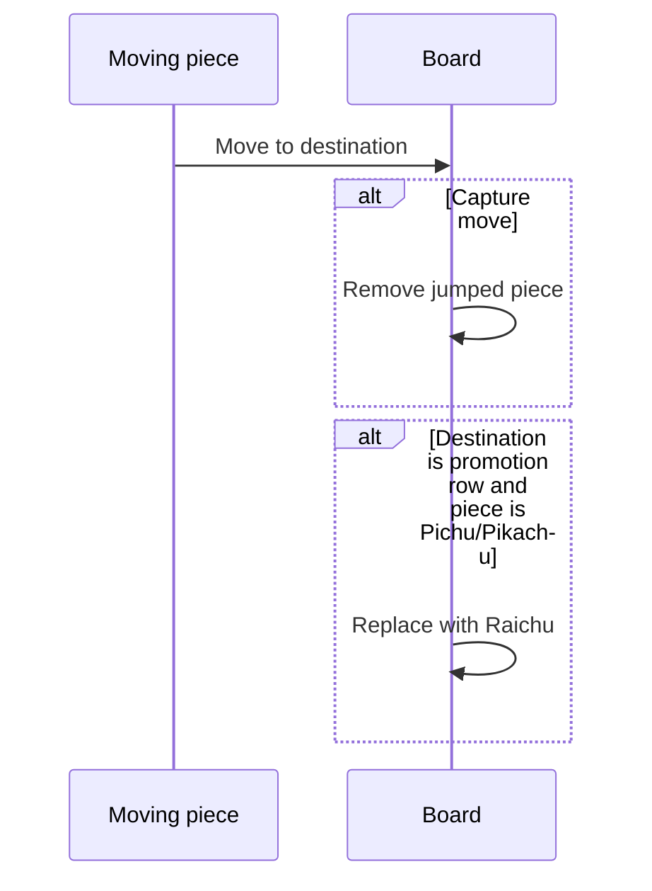

# Raichu Game Context File

> **Historical agent context:** This exhaustive prompt-oriented reference is
> retained for provenance. Start with the canonical
> [rules and notation](../docs/game/rules-and-notation.md) and
> [game theory](../docs/game/game-theory.md) documents for current project
> documentation.

Source: `CS B551 - Assignment 2: Games and Bayesian Classifiers`, Part 1: **Raichu**. This context file is a faithful engineering summary of the rules and examples in the PDF, reorganized for implementation work in Claude Code. See the original assignment for the authoritative wording and diagrams. fileciteturn0file0L28-L87

---

## 1. One-line summary

Raichu is a two-player perfect-information board game played on an `n x n` board, where `n >= 8` and `n` is even. Each side controls three piece types:

- `w` / `b` = **Pichu**
- `W` / `B` = **Pikachu**
- `@` / `$` = **Raichu**

White moves first. The goal is to capture all opposing pieces. fileciteturn0file0L28-L87

---

## 2. Board model and notation

### 2.1 Dimensions

- Board size: `n x n`
- Typical assignment examples use `n = 8`
- Coordinates in the PDF are shown as:
  - rows increasing from top to bottom
  - columns increasing from left to right

### 2.2 Cell contents

- `.` empty square
- `w` white Pichu
- `W` white Pikachu
- `@` white Raichu
- `b` black Pichu
- `B` black Pikachu
- `$` black Raichu

### 2.3 Direction convention

For implementation, the cleanest convention is:

- White moves **downward**, toward increasing row index
- Black moves **upward**, toward decreasing row index

This is consistent with the assignment text, because:

- White promotes when it reaches row `n`
- Black promotes when it reaches row `1` fileciteturn0file0L62-L73

### 2.4 Coordinate convention for code

Use zero-based indexing internally.

- Top-left = `(0, 0)`
- Bottom-right = `(n-1, n-1)`

Mapping from PDF coordinates to zero-based code coordinates:

- PDF row `r` -> code row `r - 1`
- PDF col `c` -> code col `c - 1`

---

## 3. Starting position

The initial board is empty except for:

- row 2: white Pikachus
- row 3: white Pichus
- row `n - 2`: black Pichus
- row `n - 1`: black Pikachus fileciteturn0file0L28-L40

For `n = 8`, the encoded start state in the PDF is:

```text
........W.W.W.W..w.w.w.w................b.b.b.b..B.B.B.B........
```

This decodes to:

```text
    1 2 3 4 5 6 7 8
1 | . . . . . . . .
2 | W . W . W . W .
3 | . w . w . w . w
4 | . . . . . . . .
5 | . . . . . . . .
6 | b . b . b . b .
7 | . B . B . B . B
8 | . . . . . . . .
```

### Mermaid setup diagram



---

## 4. Piece hierarchy and capture permissions

The assignment defines a strict hierarchy: fileciteturn0file0L74-L87

- **Pichu** captures only opposing **Pichu**
- **Pikachu** captures opposing **Pichu** or **Pikachu**
- **Raichu** captures **any** opposing piece

This is critical. Do not treat the game like standard checkers where all pieces can jump all enemy pieces.

### Mermaid hierarchy diagram



---

## 5. Turn structure

On each turn:

1. The current player selects exactly one piece of their own color.
2. That piece makes one legal move according to its type.
3. If a capture occurs, the jumped piece is removed immediately. fileciteturn0file0L30-L73

The PDF examples show single jumps and single resulting positions. The rules do **not** describe multi-jump chaining within one move. For this assignment context, implement exactly what is written: one legal move, with at most one jumped enemy removed as part of that move.

### Mermaid move lifecycle



---

## 6. Pichu rules

### 6.1 Movement

A Pichu moves in one of two ways: fileciteturn0file0L41-L52

1. Move one square **forward diagonally** into an empty square.
2. Jump over a single opposing **Pichu** by moving two squares **forward diagonally**, if:
   - the middle square contains an enemy Pichu
   - the landing square is empty

The jumped piece is removed immediately.

### 6.2 White Pichu vectors

In zero-based row/col deltas:

- quiet move: `( +1, -1 )`, `( +1, +1 )`
- jump move: `( +2, -2 )`, `( +2, +2 )`

### 6.3 Black Pichu vectors

- quiet move: `( -1, -1 )`, `( -1, +1 )`
- jump move: `( -2, -2 )`, `( -2, +2 )`

### 6.4 Pichu example from the PDF

The highlighted white Pichu starts at `(row 3, col 2)` in PDF coordinates.

Initial board shown in the PDF:

```text
    1 2 3 4 5 6 7 8
1 | . . . . . . . .
2 | W . W . W . W .
3 | . w . w . w . w
4 | . . b . . . . .
5 | . . . . . . . .
6 | b . b . . . b .
7 | . B . B . B . B
8 | . . . . . . . .
```

Possible move #1 in the PDF:
- move from `(3,2)` to `(4,1)`
- this is a normal diagonal forward move

```text
    1 2 3 4 5 6 7 8
1 | . . . . . . . .
2 | W . W . W . W .
3 | . . . w . w . w
4 | w . b . . . . .
5 | . . . . . . . .
6 | b . b . . . b .
7 | . B . B . B . B
8 | . . . . . . . .
```

Possible move #2 in the PDF:
- jump from `(3,2)` to `(5,4)`
- captures the black Pichu at `(4,3)`

```text
    1 2 3 4 5 6 7 8
1 | . . . . . . . .
2 | W . W . W . W .
3 | . . . w . w . w
4 | . . . . . . . .
5 | . . . w . . . .
6 | b . b . . . b .
7 | . B . B . B . B
8 | . . . . . . . .
```

### Mermaid Pichu move diagram



### Pichu implementation rules

- Pichu never moves backward
- Pichu never moves horizontally or vertically
- Pichu never captures Pikachu or Raichu
- Pichu capture is a single forward diagonal jump over exactly one enemy Pichu

---

## 7. Pikachu rules

### 7.1 Movement

A Pikachu moves in one of two ways: fileciteturn0file0L53-L61

1. Move `1` or `2` squares **forward, left, or right** to an empty square, with all intermediate squares empty.
2. Jump over a single opposing **Pichu or Pikachu** by moving `2` or `3` squares **forward, left, or right**, with:
   - all squares before the jumped piece empty
   - exactly one jumped enemy piece of an allowed type
   - all squares after the jumped piece and before the landing square empty
   - landing square empty

No diagonal movement. No backward movement.

### 7.2 White Pikachu directions

- forward = downward
- sideways = left or right
- allowed quiet displacements:
  - `( +1, 0 )`, `( +2, 0 )`
  - `( 0, -1 )`, `( 0, -2 )`
  - `( 0, +1 )`, `( 0, +2 )`

### 7.3 Black Pikachu directions

- forward = upward
- sideways = left or right
- allowed quiet displacements:
  - `( -1, 0 )`, `( -2, 0 )`
  - `( 0, -1 )`, `( 0, -2 )`
  - `( 0, +1 )`, `( 0, +2 )`

### 7.4 Capture geometry

A Pikachu capture spans total distance `2` or `3` in one of the allowed directions.

That means:
- the enemy may be adjacent, with one empty landing square beyond
- or there may be one empty square before the enemy and then an empty landing square beyond

Examples in a rightward capture lane:

```text
Case A: jump length 2
P x .

Case B: jump length 3
P . x .
```

Where:
- `P` = moving Pikachu
- `x` = enemy Pichu or Pikachu
- `.` = required empty square

### 7.5 Pikachu example from the PDF

The highlighted white Pikachu starts at `(5,2)` in PDF coordinates.

Initial board shown in the PDF:

```text
    1 2 3 4 5 6 7 8
1 | . . . . . . . .
2 | W . W . W . W .
3 | . w . . . w . w
4 | . . w . . . . .
5 | . W . . . . . .
6 | b . b . b . b .
7 | . . . B . B . B
8 | . . . . . . . .
```

Possible move #1 in the PDF:
- move left from `(5,2)` to `(5,1)`

```text
    1 2 3 4 5 6 7 8
1 | . . . . . . . .
2 | W . W . W . W .
3 | . w . . . w . w
4 | . . w . . . . .
5 | W . . . . . . .
6 | b . b . b . b .
7 | . . . B . B . B
8 | . . . . . . . .
```

Possible move #2 in the PDF:
- move right from `(5,2)` to `(5,4)`
- legal because a Pikachu may move 1 or 2 squares horizontally through empty squares

```text
    1 2 3 4 5 6 7 8
1 | . . . . . . . .
2 | W . W . W . W .
3 | . w . . . w . w
4 | . . w . . . . .
5 | . . . W . . . .
6 | b . b . b . b .
7 | . . . B . B . B
8 | . . . . . . . .
```

Possible move #3 in the PDF:
- move from `(5,2)` to `(2,2)` is **not** legal under the written rules because Pikachu cannot move backward
- the actual highlighted destination in the figure is the top-left board region and visually represents a legal example from the PDF image set, but for implementation you must follow the text rules, not guess from a low-resolution figure

For coding, trust the written rule set above. The PDF text is authoritative. fileciteturn0file0L53-L61

### Mermaid Pikachu movement diagram



### Pikachu implementation rules

- no diagonal movement
- no backward movement
- no capture of enemy Raichu
- path between start and destination must be clear, except for the one jumped enemy in a capture move

---

## 8. Promotion rules

A **Pichu** or **Pikachu** promotes when it reaches the opposite edge: fileciteturn0file0L62-L73

- White promotes on row `n`
- Black promotes on row `1`

When promotion happens:

1. remove the Pichu or Pikachu from the board
2. place a Raichu of the same color on that square

### Mermaid promotion diagram



Important:
- there is no separate “kinged Pichu” state
- promotion always creates a **Raichu**, not a stronger Pichu or Pikachu

---

## 9. Raichu rules

### 9.1 Movement

A Raichu moves like a queen in chess: fileciteturn0file0L62-L73

- any number of squares
- along any of the 8 directions:
  - up
  - down
  - left
  - right
  - diagonal up-left
  - diagonal up-right
  - diagonal down-left
  - diagonal down-right
- all intermediate squares must be empty

### 9.2 Capture

A Raichu captures by jumping over exactly one opposing piece of **any** type and landing any number of squares beyond it along the same line, as long as:

- all squares between start and jumped piece are empty
- the jumped piece is the first occupied square encountered in that direction
- all squares after the jumped piece up to the landing square are empty
- landing square is empty

This is not standard chess capture. It is long-range jump capture.

### 9.3 Allowed capture targets

Raichu can capture:

- enemy Pichu
- enemy Pikachu
- enemy Raichu

### 9.4 Raichu example from the PDF

The highlighted white Raichu starts at `(8,1)` in PDF coordinates.

Initial board shown in the PDF:

```text
    1 2 3 4 5 6 7 8
1 | . . . . . . . .
2 | . . w . w . w .
3 | . w . w . w . w
4 | . . . . . . . .
5 | . . . . . . . .
6 | . . . . b . b .
7 | . B . B . B . B
8 | @ . . . . . . .
```

Possible move #1 in the PDF:
- move vertically from `(8,1)` to `(1,1)`

```text
    1 2 3 4 5 6 7 8
1 | @ . . . . . . .
2 | . . w . w . w .
3 | . w . w . w . w
4 | . . . . . . . .
5 | . . . . . . . .
6 | . . . . b . b .
7 | . B . B . B . B
8 | . . . . . . . .
```

Possible move #2 in the PDF:
- move horizontally from `(8,1)` to `(8,7)`

```text
    1 2 3 4 5 6 7 8
1 | . . . . . . . .
2 | . . w . w . w .
3 | . w . w . w . w
4 | . . . . . . . .
5 | . . . . . . . .
6 | . . . . b . b .
7 | . B . B . B . B
8 | . . . . . . @ .
```

Possible move #3 in the PDF:
- move diagonally from `(8,1)` to `(4,5)`

```text
    1 2 3 4 5 6 7 8
1 | . . . . . . . .
2 | . . w . w . w .
3 | . w . w . w . w
4 | . . . . @ . . .
5 | . . . . . . . .
6 | . . . . b . b .
7 | . B . B . B . B
8 | . . . . . . . .
```

### Mermaid Raichu movement diagram



### Ray-tracing interpretation for implementation

For each of 8 directions:

1. step outward until blocked or off-board
2. every empty square before the first occupied square is a legal quiet move
3. if first occupied square is an enemy of capturable type:
   - continue stepping beyond it
   - every empty square beyond it along the same ray is a legal landing square for a capture move
4. stop once a second occupied square appears or board edge is reached

---

## 10. Win condition

The winner is the player who first captures all opposing pieces. fileciteturn0file0L74-L87

### Mermaid terminal condition diagram



---

## 11. Program interface from the PDF

The assignment expects a program called like this: fileciteturn0file0L75-L116

```bash
python3 ./raichu.py <n> <player> <board_string> <time_limit_seconds>
```

Arguments:

1. `n` = board size
2. `player` = `w` or `b`
3. `board_string` = row-major encoded board
4. `time_limit_seconds` = time budget

Output rule:
- the last printed line must be the chosen next board state encoded in row-major form

The grader looks only at the last printed solution.

---

## 12. Canonical internal representation for engineering

For a clean implementation, use this model.

### 12.1 Board

```python
board: list[list[str]]
```

Each cell is one of:

```python
'.', 'w', 'W', '@', 'b', 'B', '$'
```

### 12.2 Move object

```python
Move = {
    "from": (r1, c1),
    "to": (r2, c2),
    "piece": "w|W|@|b|B|$",
    "is_capture": bool,
    "captured": None or (rc, cc),
    "captured_piece": None or "w|W|@|b|B|$",
    "promotion": bool,
    "promoted_to": None or "@|$"
}
```

### 12.3 Helper predicates

Implement these helpers early:

- `is_white(piece)`
- `is_black(piece)`
- `is_enemy(piece_a, piece_b)`
- `inside(r, c, n)`
- `capturable_by_pichu(attacker, target)`
- `capturable_by_pikachu(attacker, target)`
- `capturable_by_raichu(attacker, target)`

---

## 13. Legal move generation rules by piece

### 13.1 Pichu generator

For a given Pichu at `(r, c)`:

1. determine forward sign based on color
2. test the two diagonal quiet destinations
3. test the two diagonal jump destinations
4. for jumps:
   - intermediate square must contain enemy Pichu only
   - landing square must be empty
5. if destination is promotion row, mark promotion

### 13.2 Pikachu generator

For a given Pikachu at `(r, c)`:

Quiet moves in 3 directions:
- forward
- left
- right

For each direction:
- distance 1 or 2
- all traversed squares must be empty

Capture moves in same 3 directions:
- distance 2 or 3
- exactly one jumped enemy of type Pichu or Pikachu
- all other traversed squares empty
- destination empty

Promotion check after move.

### 13.3 Raichu generator

For each of 8 rays:

- collect empty squares until first occupied square
- those empties are quiet moves
- if first occupied square is enemy, then any empty square beyond it on same ray is a legal capture landing square
- stop after second occupied square or edge

---

## 14. Promotion edge cases

- Promotion occurs when a Pichu or Pikachu **ends** a legal move on the far edge.
- A capturing move that lands on the far edge promotes immediately.
- Raichu never promotes further.
- Promotion replaces the moved piece on the board after the move resolution.

### Mermaid promotion resolution



---

## 15. Encoding and decoding board strings

The PDF uses row-major order. fileciteturn0file0L75-L116

### Decode

```python
def decode_board(board_string, n):
    return [list(board_string[i:i+n]) for i in range(0, n*n, n)]
```

### Encode

```python
def encode_board(board):
    return ''.join(''.join(row) for row in board)
```

---

## 16. Example: start-state encoding and decoding

Encoded string:

```text
........W.W.W.W..w.w.w.w................b.b.b.b..B.B.B.B........
```

Decoded grid:

```text
........
W.W.W.W.
.w.w.w.w
........
........
b.b.b.b.
.B.B.B.B
........
```

This exact example appears in the PDF. fileciteturn0file0L81-L116

---

## 17. Engineering constraints that matter for Claude Code

### 17.1 Trust text over images

The PDF images are useful for intuition, but for implementation:
- the written rule text is authoritative
- especially for movement limits and capture permissions

### 17.2 No invented mechanics

Do not add:
- mandatory captures
- multi-jump chains
- backward Pikachu movement
- backward Pichu movement
- standard chess capture for Raichu
- standard checkers king logic

### 17.3 Raichu is queen-like in movement only

It is not a chess queen in capture mechanics.
It still captures by **jumping over** one enemy and landing beyond it.

### 17.4 Piece hierarchy matters

This is one of the most important non-obvious rules in the assignment.
A lot of wrong implementations fail here.

---

## 18. Recommended validation tests

### 18.1 Pichu tests

- white diagonal one-step move works
- black diagonal one-step move works
- white cannot move backward
- Pichu cannot capture Pikachu
- jump requires empty landing square
- promotion to Raichu occurs on far edge

### 18.2 Pikachu tests

- move 1 and 2 squares forward/left/right
- cannot move diagonally
- cannot move backward
- capture length 2 works
- capture length 3 works
- cannot capture Raichu
- promotion works

### 18.3 Raichu tests

- queen-like sliding on all 8 directions
- jump over one enemy and land farther on same line
- cannot jump over friendly piece
- cannot jump over two pieces
- can capture enemy Raichu

### 18.4 Encoding tests

- decode then encode returns original string
- applying a legal move updates exactly the expected cells

---

## 19. Minimal rules reference table

| Piece | Symbol | Quiet movement | Capture movement | Allowed capture targets | Promotes? |
|---|---|---|---|---|---|
| White Pichu | `w` | 1 step diagonal forward | 2-step diagonal forward jump | `b` only | to `@` |
| Black Pichu | `b` | 1 step diagonal forward | 2-step diagonal forward jump | `w` only | to `$` |
| White Pikachu | `W` | 1 or 2 squares forward/left/right | 2 or 3-square forward/left/right jump | `b`, `B` | to `@` |
| Black Pikachu | `B` | 1 or 2 squares forward/left/right | 2 or 3-square forward/left/right jump | `w`, `W` | to `$` |
| White Raichu | `@` | any distance in 8 directions | jump over one enemy, land any distance beyond on same line | `b`, `B`, `$` | no |
| Black Raichu | `$` | any distance in 8 directions | jump over one enemy, land any distance beyond on same line | `w`, `W`, `@` | no |

---

## 20. Short prompt-ready summary for Claude Code

Use this when you want a compact instruction block.

```text
Implement Part 1: Raichu from the IU CS B551 assignment.

Board:
- n x n, even n >= 8
- row-major board string
- symbols: . w W @ b B $
- white moves first
- white moves downward, black moves upward

Pieces:
1. Pichu
- moves 1 step diagonally forward into empty square
- captures by jumping 2 squares diagonally forward over exactly one enemy Pichu
- Pichu captures only enemy Pichu

2. Pikachu
- moves 1 or 2 squares forward, left, or right, never diagonally, never backward
- path squares must be empty
- captures by jumping 2 or 3 squares forward, left, or right over exactly one enemy Pichu or Pikachu
- Pikachu captures only enemy Pichu or Pikachu

3. Raichu
- moves any distance in 8 directions like a chess queen
- captures by jumping over exactly one enemy piece of any type and landing any empty square beyond it on same line
- path before enemy and after enemy to landing square must be empty

Promotion:
- white Pichu/Pikachu promotes to @ on last row
- black Pichu/Pikachu promotes to $ on first row

Win condition:
- capture all opponent pieces

Important:
- do not invent mandatory captures
- do not invent multi-jumps
- trust the written rules over diagram ambiguity
- enforce the capture hierarchy strictly
```

---

## 21. Final implementation notes

For search code, the most reliable architecture is:

1. `decode_board`
2. `generate_moves(board, player)`
3. `apply_move(board, move)`
4. `evaluate(board, player)`
5. `minimax / alpha-beta / iterative deepening`
6. `encode_board(best_board)`

For correctness, move generation is the core. If move generation is wrong, search strength does not matter.

---

## 22. Source note

This file was reconstructed from the uploaded assignment PDF, especially Part 1 pages 2 through 4, including the piece rules, promotion rules, hierarchy, start state encoding, and example diagrams. fileciteturn0file0L28-L116
