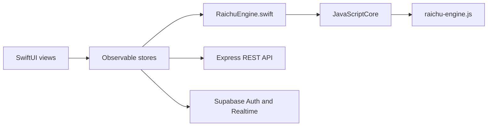

# Raichu iOS app

This is the active native iOS 26.2+ SwiftUI application.

## Architecture

The UI and platform integrations are native Swift. Game rules and AI are bundled from the shared TypeScript packages and executed through JavaScriptCore, keeping web, API, and iOS on one deterministic engine implementation.



## Project map

| Path | Purpose |
|---|---|
| `Raichu/Engine/` | JavaScriptCore bridge and shared move/board types |
| `Raichu/Stores/` | offline, online, auth, matchmaking, and UI state |
| `Raichu/Networking/` | REST, Supabase, reachability, notifications |
| `Raichu/Views/` | feature screens and shared visual components |
| `Raichu/Assets.xcassets/` | app, logo, and piece assets |
| `RaichuTests/` | Swift Testing unit tests |
| `RaichuUITests/` | XCUIAutomation tests |
| `Raichu/ios app/` | phase-oriented implementation workbook |

## Build the engine bundle

From the monorepo root:

```bash
pnpm install
pnpm build
pnpm build:ios
```

Then build the Xcode project. The generated `Raichu/Engine/raichu-engine.js` is gitignored and must be included in the app target's bundle resources.

Do not modify the iOS bundle script, entry point, global name, format, or exported function names without explicit coordination. Do not add an iOS `package.json` or place the native project in Turbo.

## Configuration

- Set `SUPABASE_ANON_KEY` in the Xcode scheme environment.
- Debug REST requests target the local API.
- Release requests target the production `/api/v1` endpoint.
- Never commit real service-role credentials.

## Documentation

- [Canonical iOS platform guide](../../../docs/platforms/ios.md)
- [Documentation hub](../../../docs/README.md)
- [Implementation workbook](../../../docs/ios-workbook/00_PROJECT_OVERVIEW.md) (historical)
- [Testing workbook](../../../docs/ios-workbook/08_TESTING.md) (historical)
- [Xcode setup](../../../docs/ios-workbook/09_XCODE_SETUP.md) (historical)
