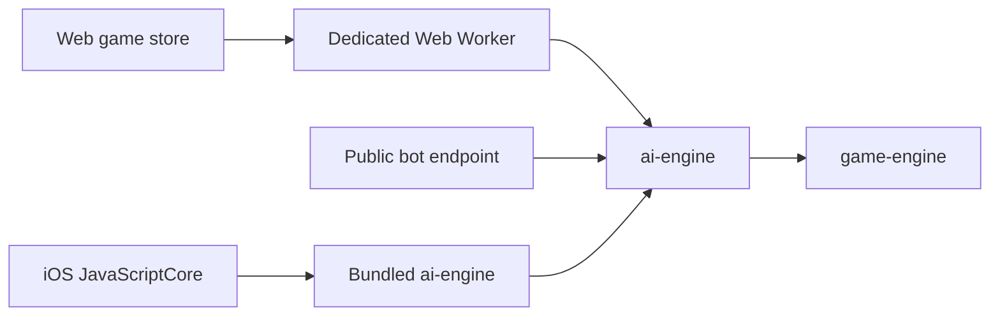
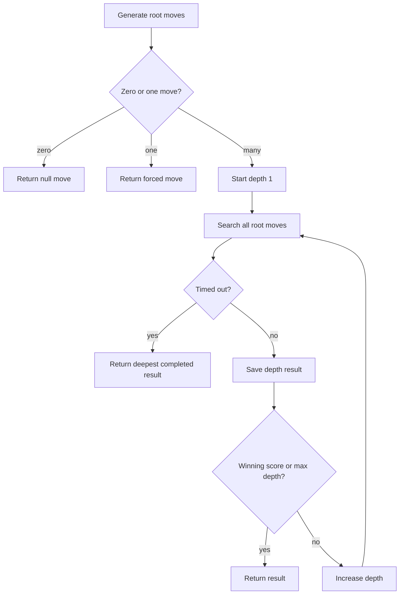

# AI engine

**Status:** Canonical implementation reference.

Package: `@raichu/ai-engine`

Location: `packages/ai-engine/`

The AI chooses a legal move with iterative-deepening minimax, alpha-beta pruning, move ordering, and a time/depth-bounded heuristic evaluation.

## Runtime placement



Browser bot search runs off the rendering thread. API search runs synchronously in the Node request handler. iOS search runs through the JavaScriptCore bridge.

## Public result

```typescript
interface SearchResult {
  move: Move | null;
  board: Board | null;
  evaluation: number;
  nodesSearched: number;
  depth: number;
  durationMs: number;
}
```

- `move` and `board` are `null` when no legal action exists.
- `depth` is the deepest fully completed iterative-deepening layer.
- `nodesSearched` includes nodes visited in timed-out iterations.
- `evaluation` is from the requested player's perspective.

## Difficulty presets

| Difficulty | Maximum depth | Time budget |
|---|---:|---:|
| Easy | 6 | 400 ms |
| Medium | 8 | 800 ms |
| Hard | 12 | 1500 ms |

The first bound reached stops deeper work. Actual completed depth depends on position branching and device/runtime speed.

## Iterative deepening

The root searches depth 1, then 2, and so on. A result replaces the previous best only if the entire depth completes before timeout.



Elapsed time is checked every 1000 visited nodes to reduce clock-call overhead, so the budget is approximate rather than a hard real-time deadline.

## Minimax and alpha-beta

At maximizing nodes, the search chooses the largest child score; at minimizing nodes, the smallest. Alpha and beta bound the best values each side can already force.

```text
alphaBeta(board, player, depth, alpha, beta, maximizing):
  count node and periodically check time
  if terminal by piece count: return win/loss score
  if depth exhausted: return evaluate(board, rootPlayer)
  moves = order(generateAllMoves(board, player))
  if moves empty: side to move loses
  recurse on each applied move
  stop sibling search when alpha >= beta
```

Move ordering determines how early useful cutoffs occur.

## Move ordering

Moves receive an ordering score:

1. captures receive a large base bonus plus captured value minus attacker value;
2. promotions receive an additional bonus; and
3. quiet moves remain at the base score.

This is MVV-LVA-inspired ordering, not a full static exchange evaluation. Ordering values are search hints and are separate from position evaluation values.

## Position evaluation

`evaluate(board, player)` returns a positive score when a position favors `player` and a negative score when it favors the opponent.

### Material

| Type | Base value |
|---|---:|
| Pichu | 100 |
| Pikachu | 300 |
| Raichu | 900 |

### Advancement

For a non-Raichu piece:

```text
White: advancement = row
Black: advancement = 7 - row
bonus = advancement * 8
if advancement >= 5:
  bonus += (advancement - 4) * 15
```

Raichus receive no advancement bonus because they cannot promote again.

### Center

```text
centerDistance = abs(row - 3.5) + abs(col - 3.5)
centerBonus = max(0, (4 - centerDistance) * 5)
```

The same geometric bonus applies to every piece; sign depends on ownership.

### Terminal scores

`WIN_SCORE` is `100000`. The evaluator's `isTerminal` checks whether either color has no pieces. The search separately treats a node with no legal moves as a loss for the side to move. Depth is folded into terminal values so the search prefers faster wins and delays losses.

## Browser worker protocol

The web worker accepts a request ID, board, player, and difficulty, and returns the same ID with a `SearchResult` or error. The client:

- creates the worker lazily;
- keeps pending promises by ID;
- terminates/reset on worker error;
- applies a ten-second outer timeout; and
- uses direct dynamic import only when workers are unavailable, such as tests or server execution.

## Complexity

Unpruned minimax is exponential in depth:

\[
O(b^d)
\]

where `b` is legal branching and `d` search depth. Good alpha-beta ordering can substantially reduce explored nodes, but position geometry and time limits dominate observed depth. Do not publish fixed “moves ahead” claims without representative benchmarks.

## Current limitations

- No transposition table or position hashing.
- No repetition-aware search state.
- No quiescence search, killer moves, or history heuristic.
- Evaluation omits mobility, threats, protection, and promotion safety.
- Time checks every 1000 nodes can overshoot small budgets.
- API bot search is synchronous and has no route-level rate limiting.
- iOS JavaScriptCore search needs an explicit background boundary for consistently smooth hard searches.

## Safe improvement process

1. Add a versioned benchmark position set.
2. Define tactical correctness and performance metrics separately.
3. Change one evaluation/search feature at a time.
4. Verify every returned move is legal.
5. Compare node count, completed depth, duration, and tactical result.
6. Run browser-worker and iOS-bundle contract checks.
7. Recalibrate difficulty budgets only after representative device measurements.

## Related documents

- [Game theory](game/game-theory.md)
- [Strategy and balance](game/strategy-and-balance.md)
- [Game engine](GAME_ENGINE.md)
- [Runtime flows](architecture/runtime-flows.md)
