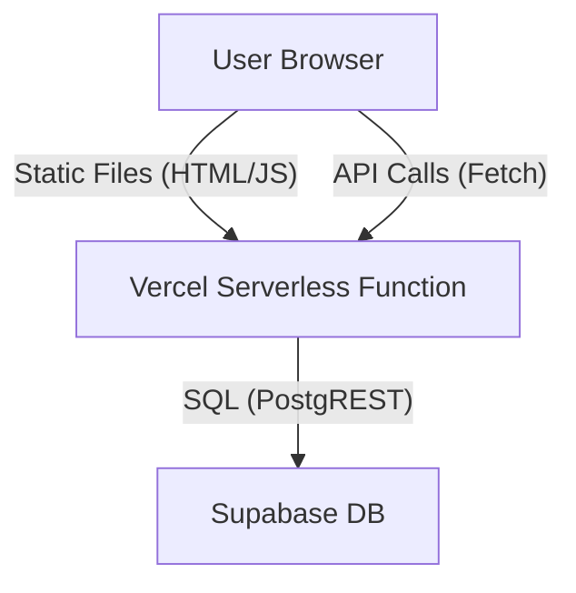

# Architecture

**Purpose:** Explain code structure and module responsibilities.  
**Audience:** Engineers  
**Last Verified Commit:** `16274f9`

## High-Level Map

## Folder Structure
-   `/` (Root)
    -   `index.html`: Entry point, UI skeleton.
    -   `script.js`: **The Monolith**. Contains:
        -   Game State (`gameState`)
        -   Rendering (`renderBoard`)
        -   Logic (`makeMove`, `getPossibleMoves`)
        -   Network Loop (`startOnlineGamePolling`)
    -   `style.css`: Visuals.
-   `api/`: Python Serverless Functions (Vercel)
    -   `multiplayer-create.py`: POST -> Insert new room.
    -   `multiplayer-join.py`: POST -> Update room (add player).
    -   `multiplayer-move.py`: POST -> Validate & Update board.
    -   `multiplayer-rooms.py`: GET -> List available rooms.
    -   `multiplayer-state.py`: GET -> Poll room state.

## Runtime Lifecycle (Frontend)
1.  **Load**: `document.readyState` check -> `initializeApp()`.
2.  **Init**: `initGame()` -> Resets `gameState` -> `renderBoard()`.
3.  **Loop**: Event Listeners wait for Click/Drag.
4.  **Online Loop**: `setInterval` (1.5s) -> Fetch `/api/multiplayer-state` -> Diff Board -> Update.

## Dependency Direction
-   Frontend depends on Backend API contracts.
-   Backend depends on Supabase Schema.
-   Backend is stateless (REST-ish).

## Key Abstractions
-   `gameState`: The Single Source of Truth for the frontend.
-   `room` (DB): The Single Source of Truth for the backend.
