# Raichu documentation

This directory is the canonical documentation home for the Raichu monorepo. Start here instead of guessing which package README or historical planning document is current.

## Choose a path

| I want to… | Start with | Continue with |
|---|---|---|
| Learn the game | [Rules and notation](game/rules-and-notation.md) | [Game theory](game/game-theory.md), [strategy and balance](game/strategy-and-balance.md) |
| Understand the whole system | [System design](architecture/system-design.md) | [Runtime flows](architecture/runtime-flows.md), [monorepo architecture](architecture/monorepo.md) |
| Work on the web app | [Web platform](platforms/web.md) | [Game engine](GAME_ENGINE.md), [API](API.md) |
| Work on the backend | [API platform](platforms/api.md) | [Database](DATABASE.md), [data and realtime](engineering/data-and-realtime.md) |
| Work on iOS | [iOS platform](platforms/ios.md) | [iOS implementation workbook](../apps/Ios-app/Raichu/Raichu/ios%20app/00_PROJECT_OVERVIEW.md) |
| Change the AI | [AI engine](AI_ENGINE.md) | [Game theory](game/game-theory.md), [testing and operations](engineering/testing-security-operations.md) |
| Contribute code | [Contributing](CONTRIBUTING.md) | [Testing, security, and operations](engineering/testing-security-operations.md) |
| Look up a term | [Glossary](reference/glossary.md) | [API contracts](api-contracts.md) |

## Documentation map

```mermaid
flowchart TD
    Hub[docs/README.md] --> Game[Game]
    Hub --> Architecture[Architecture]
    Hub --> Platforms[Platforms]
    Hub --> Engineering[Engineering]
    Hub --> Product[Product]
    Hub --> Reference[Reference]

    Game --> Rules[Rules and notation]
    Game --> Theory[Game theory]
    Game --> Balance[Strategy and balance]

    Architecture --> Design[System design]
    Architecture --> Flows[Runtime flows]
    Architecture --> Monorepo[Monorepo architecture]
    Architecture --> Decisions[Design decisions]

    Platforms --> Web[Web]
    Platforms --> API[API]
    Platforms --> IOS[iOS]

    Engineering --> Data[Data and Realtime]
    Engineering --> Quality[Testing, security, operations]

    Product --> SEO[SEO and content]
    Product --> Launch[Launch plan]

    Reference --> Glossary[Glossary]
    Reference --> Manuals[Engine, API, database manuals]
```

## Canonical documents

### Game

- [Rules and notation](game/rules-and-notation.md) — the playable rules, coordinates, encoding, promotion, termination, and mode-specific draw behavior.
- [Game theory](game/game-theory.md) — formal classification, state space, utility, branching, strategic tension, and implications for search.
- [Strategy and balance](game/strategy-and-balance.md) — practical strategic model, measurable balance questions, and a responsible balancing process.

### Architecture

- [System design](architecture/system-design.md) — system context, containers, trust boundaries, deployment, quality attributes, and scaling model.
- [Runtime flows](architecture/runtime-flows.md) — sequence diagrams for local play, bot search, online moves, Realtime recovery, matchmaking, and authentication.
- [Monorepo architecture](architecture/monorepo.md) — workspace boundaries, package dependency graph, build graph, and change-impact guide.
- [Design decisions](architecture/design-decisions.md) — concise architecture decision records and their trade-offs.

### Platforms

- [Web](platforms/web.md) — Next.js routes, Zustand stores, rendering, interaction, AI worker, and accessibility.
- [API](platforms/api.md) — Express layers, authorization, game authority, matchmaking, ratings, and failure behavior.
- [iOS](platforms/ios.md) — SwiftUI structure, JavaScriptCore bridge, stores, network paths, and platform constraints.

### Engineering

- [Data and Realtime](engineering/data-and-realtime.md) — PostgreSQL ownership, row-level security, event propagation, consistency, analytics, and retention.
- [Testing, security, and operations](engineering/testing-security-operations.md) — test boundaries, CI, secrets, observability, incident checks, and release readiness.
- [Contributing](CONTRIBUTING.md) — local environment, commands, code style, and pull-request workflow.
- [GitHub setup](github-setup.md) — branch protection, required checks, Dependabot, and repository settings.

### Product

- [SEO and content](product/seo-and-content.md) — search architecture, topic clusters, technical review, linking, and measurement.
- [Launch plan](launch-plan.md) — channel-specific rollout and launch copy.

### Detailed reference manuals

- [Game engine API](GAME_ENGINE.md)
- [AI engine](AI_ENGINE.md)
- [REST API reference](API.md)
- [Database reference](DATABASE.md)
- [Compact API contracts](api-contracts.md)
- [Glossary](reference/glossary.md)
- [Documentation style guide](reference/documentation-style-guide.md)

## Source-of-truth policy

Documentation explains the implementation; it does not replace it. When a document conflicts with code, use this order:

1. Database migrations and public TypeScript/Swift types for persisted schemas and wire shapes.
2. `packages/game-engine` for legal moves, board mutation, promotion, and base terminal status.
3. `packages/ai-engine` for search and evaluation behavior.
4. API route schemas and services for server behavior.
5. Web and iOS stores for platform-specific orchestration, including local draw handling.
6. Documentation, which should then be corrected in the same change.

The most important implementation roots are:

| Concern | Source |
|---|---|
| Shared contracts | `packages/shared-types/src/` |
| Rules | `packages/game-engine/src/` |
| Search | `packages/ai-engine/src/` |
| Server authority | `apps/api/src/` |
| Web orchestration | `apps/web/src/store/`, `apps/web/src/lib/` |
| iOS orchestration | `apps/Ios-app/Raichu/Raichu/` |
| Database | `supabase/migrations/` |
| CI | `.github/workflows/ci.yml` |

## Document status labels

Use these labels near the top of specialized documents when needed:

- **Canonical** — maintained as the current explanation of shipped behavior.
- **Reference** — detailed interface or implementation material; current unless marked otherwise.
- **Workbook** — phase-oriented implementation notes local to one platform.
- **Historical** — retained for provenance and explicitly superseded.

The files in `apps/Ios-app/Raichu/Raichu/ios app/` are an iOS implementation workbook. The large file in `Game Theory/` is an agent-oriented historical rules context. They are linked for traceability but are not the documentation entry point.

## Keeping documentation healthy

Every change that alters a public contract, rule, data flow, environment variable, deployment step, or package boundary should update the corresponding canonical document. Follow the [documentation style guide](reference/documentation-style-guide.md) and run the repository link check described there before opening a pull request.
