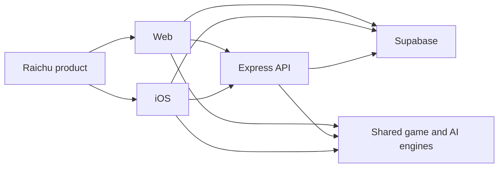

# Architecture index

**Status:** Compatibility entry point. The architecture is split into focused canonical documents.

## Start here

- [System design](architecture/system-design.md) — context, containers, trust boundaries, deployment, quality attributes, and scaling.
- [Runtime flows](architecture/runtime-flows.md) — local, bot, online, Realtime, matchmaking, authentication, ELO, and analytics sequences.
- [Monorepo architecture](architecture/monorepo.md) — package dependencies, build graph, iOS pipeline, and change impact.
- [Design decisions](architecture/design-decisions.md) — current architectural choices and trade-offs.

## Platform views

- [Web platform](platforms/web.md)
- [API platform](platforms/api.md)
- [iOS platform](platforms/ios.md)
- [Data and Realtime](engineering/data-and-realtime.md)
- [Testing, security, and operations](engineering/testing-security-operations.md)

Return to the [documentation hub](README.md) for game, reference, and contributor documentation.
