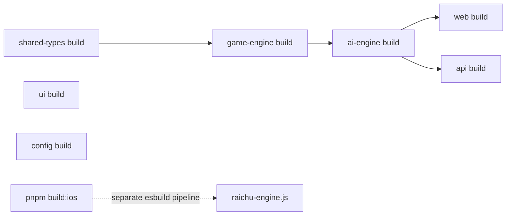
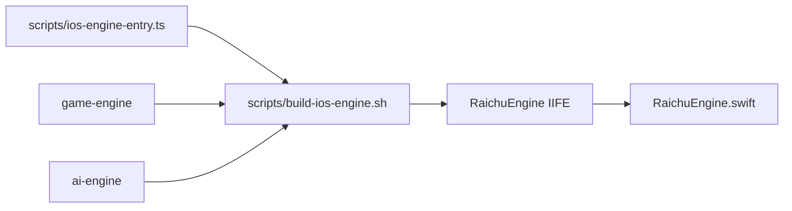

# Monorepo architecture

**Status:** Canonical package, build, and change-impact guide.

Raichu uses pnpm workspaces and Turborepo for TypeScript packages and applications. The native iOS project deliberately sits outside the Turbo task graph and consumes a separately generated JavaScriptCore bundle.

## Repository layout

```text
raichu.py/
├── apps/
│   ├── web/                         Next.js application
│   ├── api/                         Express API and matchmaker
│   └── Ios-app/Raichu/              Xcode/SwiftUI project, not a pnpm package
├── packages/
│   ├── shared-types/                cross-runtime TypeScript contracts
│   ├── game-engine/                 deterministic rules
│   ├── ai-engine/                   adversarial search
│   ├── ui/                          shared UI package scaffold
│   └── config/                      shared config package scaffold
├── scripts/                         iOS engine bundling entry/build script
├── supabase/migrations/             ordered database schema changes
├── docs/                            canonical documentation hub
└── .github/                         CI, ownership, PR template, Dependabot
```

## Dependency graph

```mermaid
flowchart TD
    Types[@raichu/shared-types]
    Engine[@raichu/game-engine]
    AI[@raichu/ai-engine]
    UI[@raichu/ui]
    Config[@raichu/config]
    Web[@raichu/web]
    API[@raichu/api]
    IOS[iOS JavaScriptCore bundle]

    Types --> Engine
    Types --> UI
    Types --> AI
    Engine --> AI
    Types --> Web
    Engine --> Web
    AI --> Web
    Types --> API
    Engine --> API
    AI --> API
    Engine --> IOS
    AI --> IOS
```

The current web package does not consume `@raichu/ui`; that package is a boundary available for future genuinely shared components.

## Turbo build graph



`turbo.json` declares `build` dependencies through `^build`; package manifests determine the edges. The iOS bundle is created only by `pnpm build:ios`, after the TypeScript packages build in CI.

## Package contracts

### Shared types

Contains compile-time types and constants. It must not import game behavior. Adding a field here does not automatically validate it at an API boundary or migrate the database.

### Game engine

Contains pure deterministic functions. It imports shared types only. It must remain free of DOM, React, Supabase, Express, and platform APIs.

### AI engine

Consumes the engine to explore positions. It may depend on time measurement, but it must not mutate UI or persisted state.

### Applications

Applications compose the packages with environment-specific concerns:

- the web app adds React, Zustand, workers, browser input, and Supabase clients;
- the API adds Express, Zod, trusted persistence, and scheduled matching; and
- iOS calls a fixed exported engine surface through JavaScriptCore.

## iOS pipeline boundary

The following contract is intentionally rigid:



The eight bridge exports are:

1. `createInitialBoard`
2. `encodeBoard`
3. `decodeBoard`
4. `generateMovesForPiece`
5. `generateAllMoves`
6. `applyMove`
7. `getGameStatus`
8. `findBestMove`

Do not rename them, change the global name, add an iOS `package.json`, or place the native project in Turbo.

## Change-impact matrix

| Change | Minimum affected areas |
|---|---|
| Shared type | all importers, wire schemas, possible migration, iOS bridge mapping |
| Legal move rule | engine tests, AI behavior, API authority, web, iOS bundle and bridge tests, rules docs |
| AI evaluation/search | AI tests/benchmarks, browser worker, bot endpoint, iOS bundle, AI docs |
| API request/response | Zod schema, shared type, web API client/store, iOS API client, API docs |
| Database column/status | forward migration, services, shared multiplayer type, Realtime handlers, RLS, database docs |
| Web-only UI | components, stores as needed, responsive/accessibility tests, web docs |
| iOS-only UI | SwiftUI views/stores, Xcode tests, iOS workbook |
| CI step | workflow, AGENTS/CLAUDE constraints, contributor and operations docs |

## Commands

```bash
pnpm install
pnpm build
pnpm test
pnpm build:ios
```

Focused examples:

```bash
pnpm --filter @raichu/game-engine test
pnpm --filter @raichu/api test
pnpm --filter @raichu/web build
```

## Versioning and compatibility

Workspace packages currently share application-style `1.0.0` versions and are private. Compatibility is enforced through the monorepo build rather than published semantic-version ranges.

Persisted board strings and move rows outlive code deployments. A rule or encoding change therefore needs an explicit compatibility plan even though packages are private.

## Ownership rules

- Keep named exports in packages.
- Validate API inputs with Zod even when a matching TypeScript type exists.
- Prefer immutable engine outputs.
- Do not introduce `any` to bridge package boundaries.
- Treat migrations as append-only history.
- Keep `AGENTS.md` and `CLAUDE.md` synchronized when repository-agent instructions change.
- Update the documentation map when adding or superseding a document.
