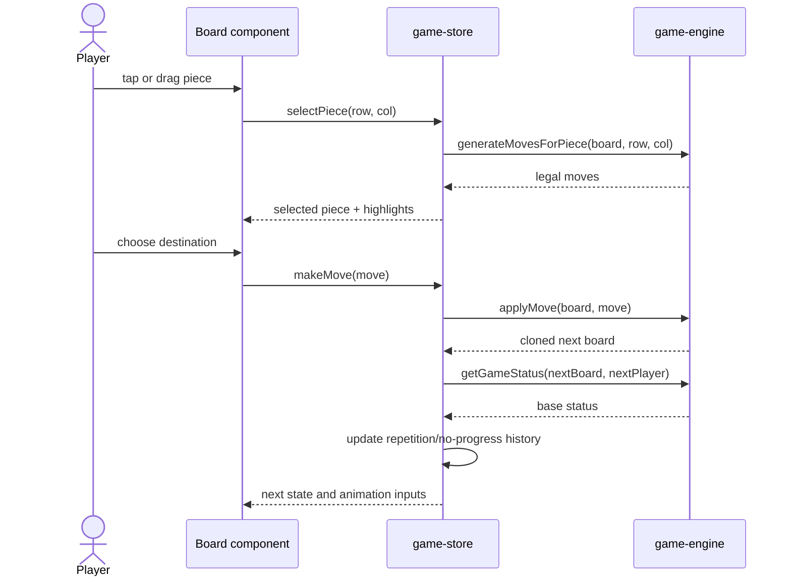
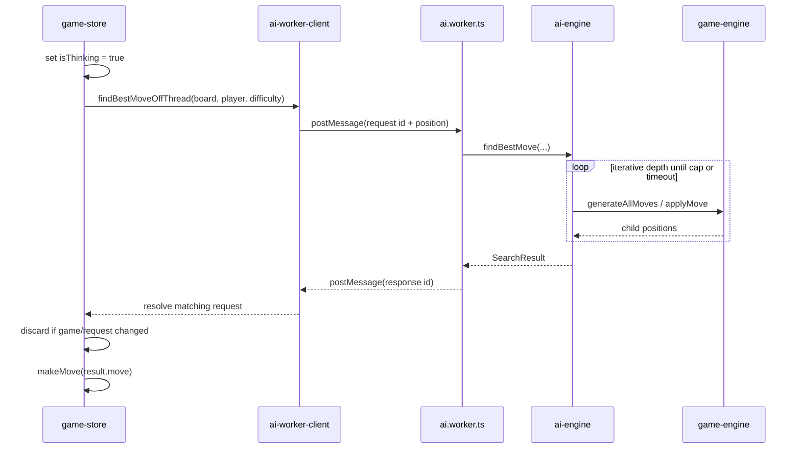
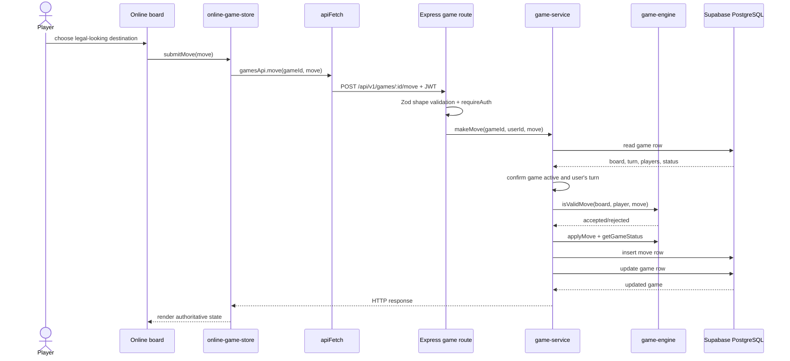
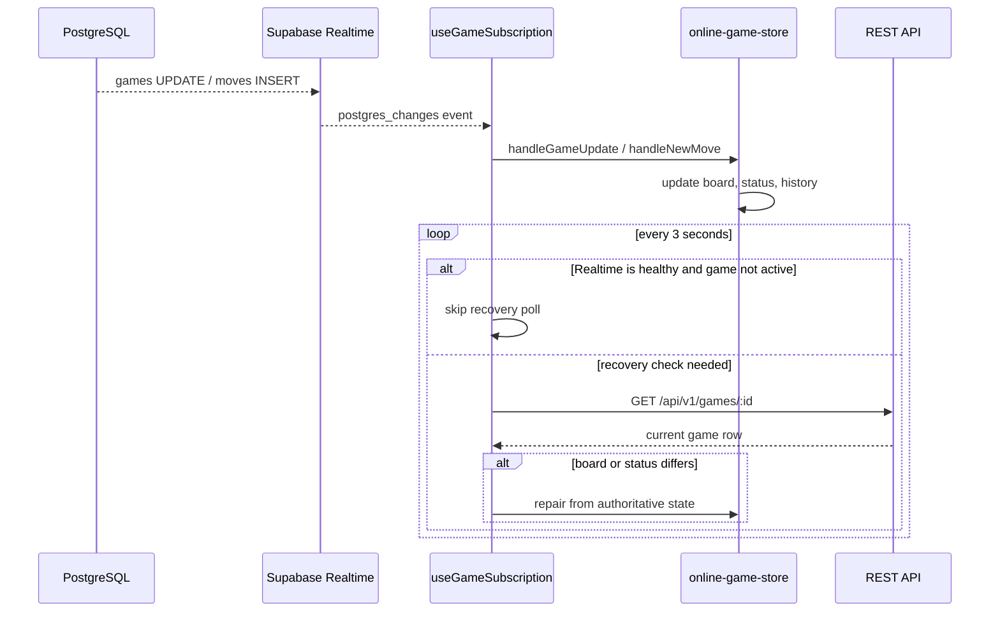
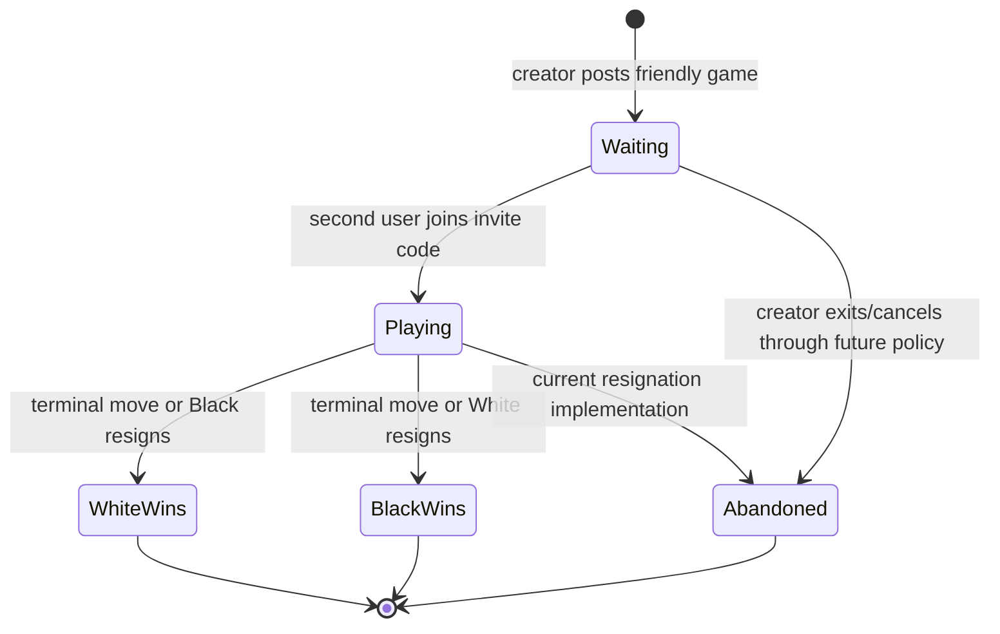
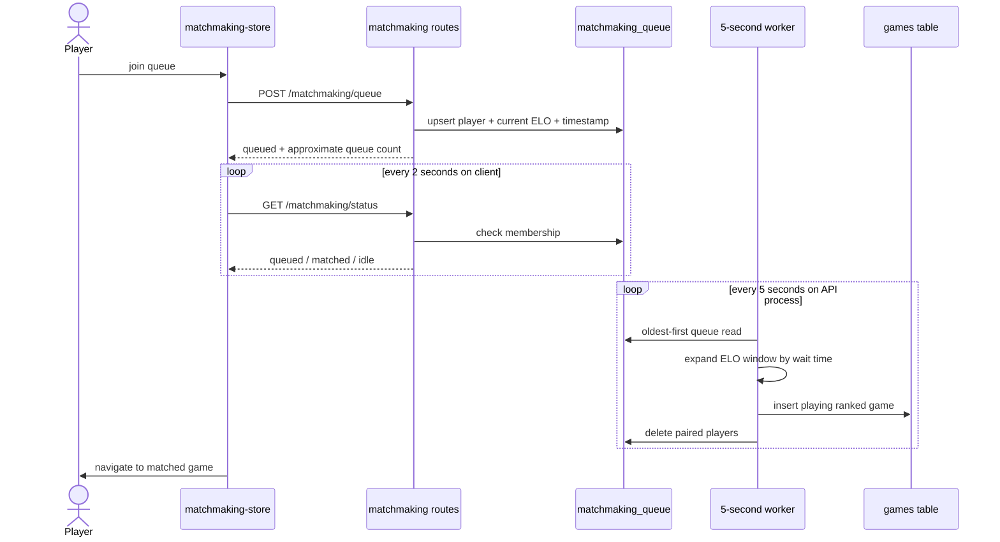
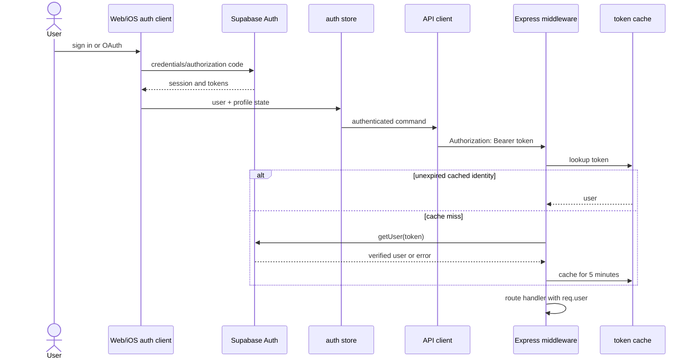
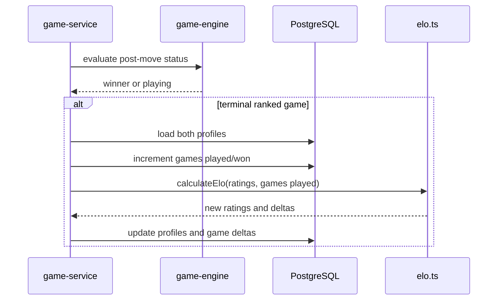
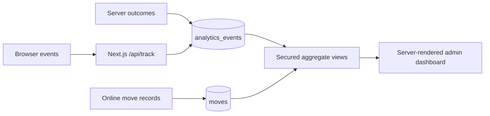

# Runtime flows

**Status:** Canonical sequence and state-flow guide.

This document follows commands through the current implementation. Function and file names are included so a reader can move from diagram to code.

## Local player move

The move engine is pure. The store owns turn advancement, history, draw counters, analytics, bot scheduling, and UI selection state.

## Browser bot move

The client maps request IDs to promises and applies a ten-second safety timeout. In server or test environments without `Worker`, it imports the AI engine and runs synchronously as a compatibility fallback.

## Online move command

The API trusts neither the client board nor client turn. It loads current state and regenerates legal moves. Capture and promotion metadata are effectively derived again when the matched generated move is used by the client; the current matcher itself compares origin and destination.

## Online update propagation and recovery

Realtime is a notification transport, not the primary database. Polling allows convergence after dropped events, tab suspension, or reconnects.

## Friendly-game lifecycle

The persisted enum has no draw state. Check actual service behavior before building UI assumptions around resignation labels because `abandoned` and winner assignment are distinct concepts.

## Ranked matchmaking

ELO window:

| Oldest player's wait | Accepted difference |
|---|---:|
| 0–15 seconds | ±100 |
| over 15–30 seconds | ±200 |
| over 30–60 seconds | ±400 |
| over 60 seconds | effectively unrestricted |

Colors are assigned randomly at match creation.

## Authentication

The cache is process-local. It improves repeat-request latency but does not create a session of its own.

## Ranked game completion and ELO

The expected score is the standard logistic ELO formula. K is 32 below 30 games, 24 below 100, and 16 afterward. The rating floor is 100.

## Analytics flow

Offline games emit compact summary events because they never create move rows. Online play-style analytics derive from persisted moves.

## Failure behavior quick reference

| Failure | User-visible effect | Recovery |
|---|---|---|
| AI worker error | bot move fails and thinking state clears | worker resets; next request creates a new worker |
| AI worker timeout | promise rejects after ten seconds | worker terminates and pending request is removed |
| Realtime disconnect | opponent move may appear late | three-second REST recovery polling |
| API unavailable | online commands fail | client surfaces request error; local modes remain available |
| Supabase unavailable | auth, persistence, matching fail | API returns errors; matchmaker counts failures |
| Matchmaker fails three intervals | new ranked pairs stop | worker pauses; operator/process restart required |
| Partial move write | history/game row can diverge | no automatic transaction repair currently |

## Related documents

- [System design](system-design.md)
- [Web platform](../platforms/web.md)
- [API platform](../platforms/api.md)
- [Data and Realtime](../engineering/data-and-realtime.md)
