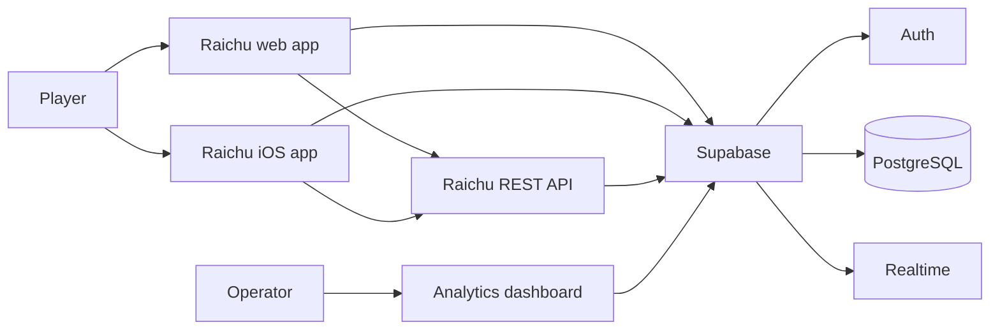
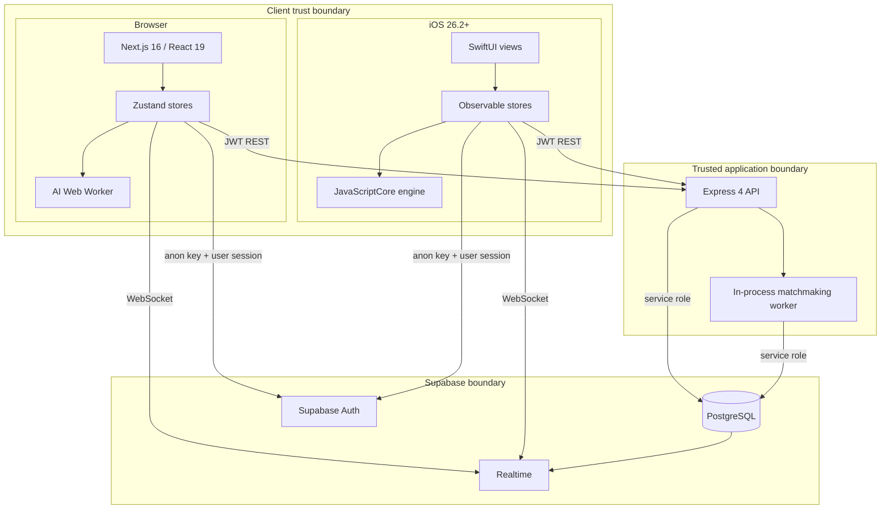
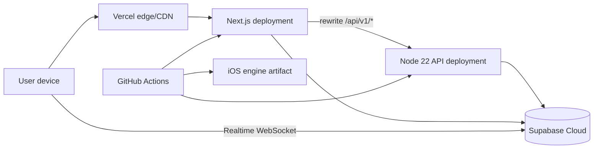

# System design

**Status:** Canonical high-level architecture and system-design guide.

Raichu is a monorepo containing a browser application, an Express API, shared deterministic game and AI packages, a Supabase backend, and a native SwiftUI client that consumes the TypeScript engine through JavaScriptCore.

## System context

The browser can run local PvP and bot games without the API. Online games use the API as the move authority and Supabase Realtime as the low-latency notification path.

## Container view

## Responsibilities

| Component | Owns | Does not own |
|---|---|---|
| `@raichu/shared-types` | cross-package board, move, game, and multiplayer types | validation or runtime behavior |
| `@raichu/game-engine` | initial board, legal moves, capture hierarchy, promotion, immutable move application, base terminal status | UI state, persistence, history-based draws |
| `@raichu/ai-engine` | evaluation and time/depth-bounded move search | game authority or rendering |
| Web app | browser rendering, local orchestration, accessibility, offline draw history, auth UX, Realtime subscription | authoritative online move acceptance |
| API | authenticated online game commands, move validation, persistence, ratings, matchmaking | browser rendering or native UI |
| Supabase | identity, persisted records, row-level security, database change publication | legal move computation |
| iOS app | native presentation, local stores, JS bridge, REST/Realtime integration | redefining engine rules independently |

## Authority model

Authority changes by mode:

| Mode | Authoritative state | Move validation | Persistence |
|---|---|---|---|
| Local PvP | web or iOS store | shared engine on device | in-memory |
| Browser bot | web store | shared engine in browser | in-memory plus analytics summary |
| iOS bot | iOS store and JSCore bridge | bundled shared engine | in-memory |
| Friendly/ranked online | Express API plus PostgreSQL | shared engine in API | `games` and `moves` tables |

Clients may predict or render a move immediately, but online truth is the server response and persisted game row.

## Trust boundaries

Important rules:

- The Supabase anon key is public by design and relies on row-level security.
- The service-role key is secret and is used only in trusted server contexts.
- A valid JWT proves identity, not move legality.
- A syntactically valid move is still rejected unless the engine generates the same origin and destination for the current player.
- Realtime events notify clients; they do not authorize commands.

## Deployment model

The repository fixes the web deployment shape through Next.js and Vercel-compatible configuration. The API host is injected through `NEXT_PUBLIC_API_URL`; the repository does not require a specific Node hosting provider.

## Quality attributes

### Correctness

- Legal-move logic is centralized in a pure package used by browser, API, tests, and the iOS bundle.
- `applyMove` returns a cloned board to avoid hidden mutation.
- Server validation regenerates legal moves instead of trusting capture or promotion metadata from the client.
- Encoded boards offer a compact common representation across runtimes.

### Responsiveness

- Browser bot search runs in a dedicated Web Worker, keeping the render and input thread responsive.
- Piece interaction and animation state live in the web client.
- Realtime delivers online updates; a three-second polling path repairs missed notifications.

### Availability

- Local and bot web games do not depend on API or Supabase availability after the app is loaded.
- Online play depends on API, database, authentication, and either Realtime or polling.
- The matchmaking worker stops after three consecutive failures and requires process/operator recovery.

### Security and privacy

- Raw analytics IP storage was removed; an optional salted hash supports coarse uniqueness and abuse analysis.
- Analytics views use `security_invoker` and revoke client-role access.
- API auth tokens are verified by Supabase and cached in process for five minutes.
- Service-role operations bypass RLS and therefore require explicit authorization checks in application code.

### Portability

- The game and AI packages avoid DOM and Node-only dependencies.
- The iOS bundle exposes eight stable functions through a global IIFE.
- API and web consume workspace packages directly through TypeScript.

## Data ownership

| Data | Owner | Replicas/caches |
|---|---|---|
| Local board and history | client store | rendered React/SwiftUI view state |
| Online board and turn | `games` row | web/iOS online stores |
| Online move history | `moves` rows | client move arrays |
| Identity | Supabase Auth | auth stores and short-lived server token cache |
| Public player statistics | `profiles` | client profile/leaderboard state |
| Queue membership | `matchmaking_queue` | matchmaking store polling state |
| Browser/server analytics | `analytics_events` | secured aggregate views |

## Scaling model

### Current shape

The design is intentionally simple and suitable for an early product:

- one API process can host routes and the matchmaking interval;
- each online move performs database reads and writes;
- Realtime is delegated to Supabase;
- bot load is mostly client-side, except callers of the public bot endpoint; and
- no distributed cache or message broker is required.

### Pressure points

| Pressure | Current risk | Natural evolution |
|---|---|---|
| Multiple API replicas | every replica starts a matchmaker, creating pairing races | single elected worker, advisory lock, or transactional database function |
| Concurrent move retries | no idempotency key or game version precondition | command id, unique constraint, optimistic version column, transaction |
| Move persistence | move insert and game update are separate writes | database transaction/RPC |
| Auth cache | per-process and best-effort | bounded LRU or local JWT verification where appropriate |
| Public bot endpoint | synchronous search consumes an API event-loop thread | worker threads, queue, rate limiting, or retire endpoint for web clients |
| Polling recovery | periodic read load grows with active games | adaptive health checks and Realtime connection state |
| Analytics growth | event table grows continuously | scheduled 180-day pruning and aggregate retention |

## Known consistency boundaries

Current code has several boundaries contributors must understand:

1. Online `makeMove` inserts a move and updates the game in separate database calls. A failure between them can leave a move record ahead of the game row.
2. The game update does not carry a version predicate, so simultaneous/retried commands are not serialized by an optimistic lock.
3. Online terminal evaluation currently calls the base status function without `nextPlayer`, so an immobilized opponent is not detected through that code path even though local play passes the next player.
4. Draw rules are local-history features and are not represented in the persisted online status enum.
5. Matchmaking assumes one active worker; query, game creation, and queue deletion are not one transaction.

These are documented behavior and improvement targets, not guarantees to build on.

## Environment boundaries

| Runtime | Required configuration |
|---|---|
| API | `SUPABASE_URL`, `SUPABASE_SERVICE_ROLE_KEY`, optional `PORT` |
| Web public | `NEXT_PUBLIC_SUPABASE_URL`, `NEXT_PUBLIC_SUPABASE_ANON_KEY`, `NEXT_PUBLIC_API_URL`, `NEXT_PUBLIC_SITE_URL` |
| Web server-only analytics | `SUPABASE_SERVICE_ROLE_KEY`, `ANALYTICS_IP_SALT` |
| iOS | Supabase URL in code/config and `SUPABASE_ANON_KEY` from the Xcode scheme environment |

Never expose the service-role key through a `NEXT_PUBLIC_*` variable or commit a real iOS key.

## Related documents

- [Runtime flows](runtime-flows.md)
- [Monorepo architecture](monorepo.md)
- [Design decisions](design-decisions.md)
- [Data and Realtime](../engineering/data-and-realtime.md)
- [Testing, security, and operations](../engineering/testing-security-operations.md)
