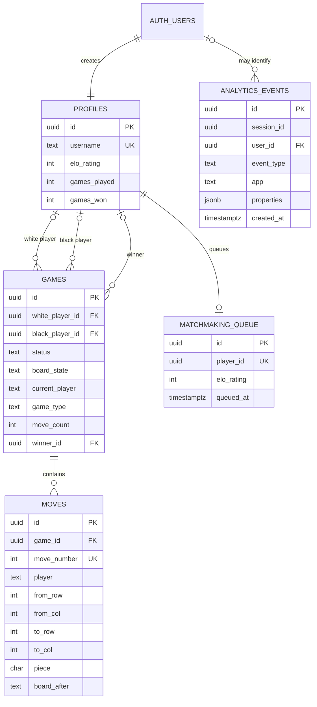
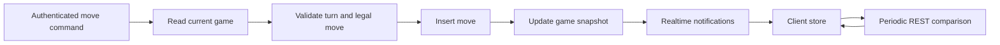
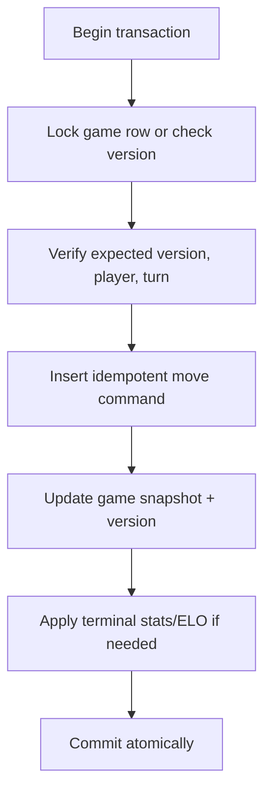

# Data and Realtime

**Status:** Canonical data ownership, consistency, and event-propagation guide. Column-by-column detail lives in the [database reference](../DATABASE.md).

Raichu uses Supabase PostgreSQL for durable application state, Supabase Auth for identity, and Supabase Realtime to publish changes to active clients.

## Core data model



## Table ownership

| Table | Writer | Reader | Lifecycle |
|---|---|---|---|
| `profiles` | signup trigger, API stats updates, user self-update under RLS | authenticated users and API | one per auth user |
| `games` | API service role | participants/waiting-game clients under RLS; API | created per online/friendly/bot record |
| `moves` | API service role | game participants under RLS; API | append-only per game, cascade deleted with game |
| `matchmaking_queue` | API service role | API only | transient until leave or pair |
| `analytics_events` | Next tracking route and API service role | secured server dashboard/views | pruned by retention policy |

## Game snapshot and event log

Online state uses both:

- `games.board_state` as the latest snapshot; and
- ordered `moves` as the event/history record, with `board_after` snapshots.

This makes current reads cheap and replay/seeking direct. It also creates a consistency obligation: the game row and latest move must describe the same position and move count.

Current writes are separate API calls rather than one transaction. A robust invariant is:

\[
games.move\_count = \max(moves.move\_number)
\]

and:

\[
games.board\_state = moves[games.move\_count].board\_after
\]

for any game with moves. An operational audit should detect violations.

## Online consistency model



The database is authoritative. Client stores are eventually consistent replicas. The HTTP command response offers immediate convergence for the mover; Realtime and polling converge the opponent.

### Desired future transaction



An idempotency key should make client retries return the existing result rather than execute twice.

## Realtime publication

Migrations set full replica identity and add `games` and `moves` to `supabase_realtime`. Clients filter channels by game ID.

Realtime properties:

- change delivery is asynchronous;
- duplicate or delayed events must be safe;
- a client can miss events while suspended/disconnected; and
- event arrival order across separate tables should not be treated as a transaction boundary.

Clients should prefer complete game snapshots for repair and treat move events as history/animation inputs.

## Row-level security

| Object | Client policy |
|---|---|
| `profiles` | authenticated read; self-update |
| `games` | participant read, plus waiting-game visibility |
| `moves` | read only when the user participates in the parent game |
| `matchmaking_queue` | no client policy; service role only |
| `analytics_events` | no client read/write policy |
| analytics views | security-invoker plus grants revoked from `anon` and `authenticated` |

### Service-role caveat

The Express API bypasses RLS. Every service using `supabaseAdmin` must reproduce the intended authorization in application code. For example, authentication alone is insufficient for a private resource read; the service must check participation/ownership explicitly.

## Status models

Persisted online status:

```text
waiting | playing | white_wins | black_wins | abandoned
```

Shared local status additionally includes `draw`. Do not insert a draw into `games.status` until a migration, API contract, server rule, Realtime handler, and both clients support it.

## Migration discipline

Migrations are ordered and forward-only:

1. `001` core tables, policies, triggers, replica identity.
2. `002` ELO indexes.
3. `003` robust profile creation.
4. `004` Realtime publication.
5. `005` analytics table and initial views.
6. `006` analytics expand phase, play-style views, retention helper.
7. `007` analytics raw-IP contract phase.
8. `008` view security hardening.

For deploy-order-sensitive changes use expand/contract:

1. add a nullable/new-compatible structure;
2. deploy code that reads/writes both as needed;
3. verify old writers are gone;
4. remove the old structure in a later migration.

Never edit an already-applied migration to change production history.

## Analytics model

Browser and API events share `analytics_events`, separated by `app = web | api | ios`. Server-authoritative outcomes should be preferred over browser claims where both exist.

Online play-style metrics derive from `moves`. Offline/bot games send one summary because they never persist per-move rows.

Analytics views cover:

- active sessions and devices;
- conversion and engagement;
- game mix and funnel;
- errors and Web Vitals;
- move facts and play style; and
- player outcomes/profile aggregates.

These aggregates describe observed behavior. They must not be presented as personality, diagnosis, or immutable user traits.

## Privacy and retention

- Raw IP storage was removed in migration `007`.
- `ip_hash` should be created with a non-public salt.
- Geo fields are coarse operational/product context.
- Flexible JSON properties require a review for sensitive or identifying content.
- `prune_analytics_events()` defaults to retaining 180 days.

Schedule retention; defining the function alone does not execute it.

## Data integrity checks

Regular checks should verify:

- exactly one profile per auth user;
- game board strings are 64 valid characters;
- move numbers are contiguous per game;
- latest move snapshot equals game snapshot;
- game `move_count` equals move history length;
- terminal games have `finished_at` and a consistent winner where applicable;
- queue rows reference live profiles and are not stale;
- Realtime publication includes `games` and `moves`;
- every public view is security-invoker and unavailable to client roles; and
- analytics retention is actually running.

Use:

```bash
pnpm check:supabase
```

## Related documents

- [Database reference](../DATABASE.md)
- [API platform](../platforms/api.md)
- [Runtime flows](../architecture/runtime-flows.md)
- [Security and operations](testing-security-operations.md)
