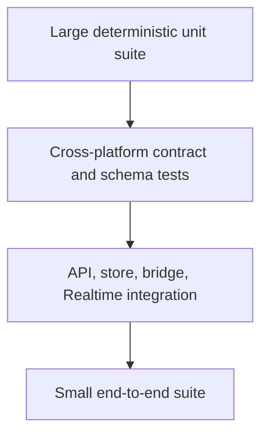
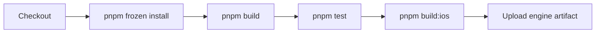
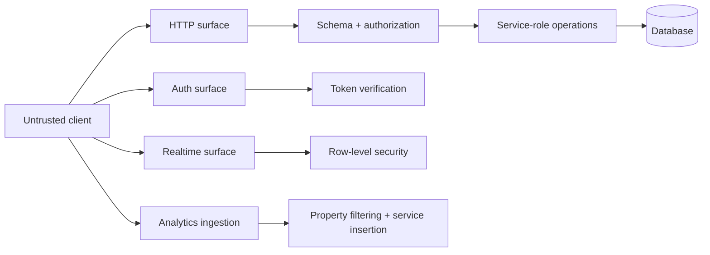

# Testing, security, and operations

**Status:** Canonical quality, threat, CI, release, and incident guide.

Raichu spans a deterministic engine, adversarial search, two clients, a trusted API, and a managed database. Tests should follow authority boundaries: prove the engine first, then orchestration, then cross-service behavior.

## Test strategy

### Unit layer

- Board creation, encoding, bounds, cloning.
- Piece ownership and capture hierarchy.
- Pichu, Pikachu, and Raichu move generation.
- Promotion, immutable move application, terminal status.
- Evaluation terms, ELO math, invite generation, play-style calculations.

### Contract layer

- TypeScript board/move JSON matches API and Swift `Codable` shapes.
- Eight iOS bridge exports exist and decode expected fixtures.
- Database status/check constraints align with shared multiplayer types.
- API schemas accept canonical engine moves and reject malformed values.
- Color-inverted/rotated positions preserve symmetric legal behavior.

### Integration layer

- Authenticated user can only execute their turn.
- API move writes consistent game and move state.
- matchmaker produces one game and removes both queue entries.
- web/iOS stores converge after an event is missed and polling repairs state.
- bot worker returns, times out, resets, and ignores stale requests correctly.

### End-to-end layer

- Start and complete a local game flow.
- Configure and play a bot game on desktop and compact mobile.
- Sign in, create/join a friendly game, exchange moves, resign/finish.
- Queue, match, navigate, and display rating result.
- Keyboard, screen-reader labels, reduced motion, and mobile overflow.

## Engine test matrix

Every move generator should cover:

| Category | Examples |
|---|---|
| Boundaries | corners, edges, no row wrapping, out-of-bounds landing |
| Blockers | friendly first, uncapturable enemy first, second occupied square |
| Capture | each allowed target and each forbidden target |
| Promotion | quiet/capture landing on promotion row, near-miss row |
| Immutability | original board unchanged after apply |
| Terminal | zero pieces and pieces-with-no-legal-moves |
| Symmetry | White fixture transformed into equivalent Black fixture |

## AI validation

AI tests need both correctness and bounded behavior:

- no legal move returns `null`;
- a forced single move returns immediately;
- returned move is always legal;
- iterative deepening keeps the deepest completed result;
- a time budget is respected within a reasonable scheduling tolerance;
- node/depth metrics are internally consistent;
- benchmark tactics prefer known wins/captures/promotions; and
- worker and direct execution return compatible move shapes.

Benchmark output is not a unit-test assertion unless the environment is controlled. Prefer relative regression thresholds and fixed tactical expectations.

## CI pipeline

CI runs on pull requests and pushes to `main`, uses Node 22 and pnpm 9.15, and cancels obsolete runs for the same branch/ref.

The iOS bundle step is outside Turbo and must remain after the TypeScript build. Artifact upload fails if the generated bundle is missing.

## Local verification by change type

| Change | Required minimum |
|---|---|
| Documentation only | `pnpm docs:check`, inspect Mermaid on GitHub-compatible preview |
| Shared types | affected builds, API/web type checking, iOS mapping review |
| Game engine | engine tests, full tests, iOS bundle |
| AI engine | AI/engine tests, worker path, full tests, iOS bundle |
| API/database | API tests, Supabase check when configured, migration/RLS review |
| Web UI | web tests, production build, responsive browser and keyboard checks |
| iOS | Swift tests/UI tests as applicable, bridge bundle smoke test |
| CI/build | full commands from a clean install or CI PR |

## Threat model

### Primary risks

| Risk | Existing defense | Remaining work |
|---|---|---|
| Forged/illegal move | JWT, turn check, generate-and-match | idempotency, transaction, full canonical metadata use |
| Cross-user data access | direct-client RLS | audit every service-role read for participant authorization |
| Bot compute abuse | body/time validation | authentication or rate limiting and max time override |
| Matchmaking race | unique queue player | single-worker enforcement/transaction |
| Token abuse | Supabase verification, five-minute cache | strict cache bound, revocation trade-off documentation |
| Analytics privacy | raw IP removal, salted hash, denied client reads | payload allowlist and scheduled retention |
| View data leak | security-invoker plus revoked grants | repeat controls for every new view and automated check |
| Secret exposure | server-only env naming and placeholders | secret scanning, rotation playbook, least-privilege review |
| Dependency compromise | lockfile, Dependabot, CI | provenance/SBOM and periodic audit policy |

## Secrets

Never commit:

- `SUPABASE_SERVICE_ROLE_KEY`;
- production access/refresh tokens;
- analytics hashing salt;
- signing certificates or provisioning profiles; or
- private deployment credentials.

The browser anon key is public by design, but it must be paired with correct RLS. A leaked service-role key requires immediate rotation and an audit of database/analytics access.

## Observability

### Signals already available

- health and version endpoints;
- server logs for API startup, matching, and errors;
- server/browser analytics events;
- Realtime status and poll-recovery events;
- Web Vitals aggregates;
- match latency/ELO-gap events; and
- CI and deployment checks.

### Signals to add before scale

- structured request IDs across API logs and errors;
- command latency/error histograms by route;
- database write inconsistency audit;
- active matchmaker heartbeat and queue age;
- Realtime disconnect/recovery rate;
- worker search latency by difficulty/device class; and
- alerting thresholds with owners.

Do not log tokens, service keys, complete request authorization headers, or sensitive analytics payloads.

## Release checklist

1. Required tests and production builds pass.
2. Database migrations are reviewed for deploy order, locks, RLS, and rollback/forward-fix path.
3. `pnpm check:supabase` passes against the target environment when schema changes are involved.
4. Web environment variables and API origin are correct.
5. iOS bundle is regenerated by CI and bridge contract tests pass.
6. Responsive, keyboard, and reduced-motion smoke tests pass.
7. Required GitHub checks are green and no unresolved security alert exists.
8. Release notes identify rule, schema, API, or persisted-encoding changes.
9. Monitoring dashboards and a rollback/forward-fix owner are available.

## Incident runbooks

### Online moves fail

1. Check `/api/v1/health` and `/api/v1/version`.
2. Check API logs and Supabase availability.
3. Confirm web rewrite points to the intended API.
4. Separate `401`, validation `400`, and database `500` rates.
5. Verify game/move consistency before replaying any command manually.

### Realtime appears stale

1. Confirm games/moves remain in Realtime publication.
2. Inspect subscription status analytics.
3. Verify REST polling returns the latest game snapshot.
4. Check RLS and authenticated session.
5. Avoid writing state directly to “fix” one client; repair the authoritative row/history first.

### Matchmaking stops

1. Inspect worker logs for three consecutive failures and pause message.
2. Check Supabase credentials/connectivity.
3. Measure oldest queue age and identify duplicate API workers.
4. Restart only after resolving the repeated failure.
5. Audit for games created without both queue rows removed.

### Suspected service-key leak

1. Rotate the key immediately.
2. Update API/web server environments and redeploy.
3. Review database and analytics access logs.
4. Validate RLS/view grants even though the service key bypasses them.
5. Remove the source from current files and history according to incident policy.
6. Document impact and prevention work.

### Data inconsistency

1. Stop automated writes to the affected game if possible.
2. Compare move count, ordered moves, latest `board_after`, and game snapshot.
3. Preserve evidence before repair.
4. Repair through an auditable migration/admin procedure, not an ad hoc client call.
5. Add a regression test and transaction/idempotency work item.

## Related documents

- [Contributing](../CONTRIBUTING.md)
- [GitHub setup](../github-setup.md)
- [System design](../architecture/system-design.md)
- [Data and Realtime](data-and-realtime.md)
