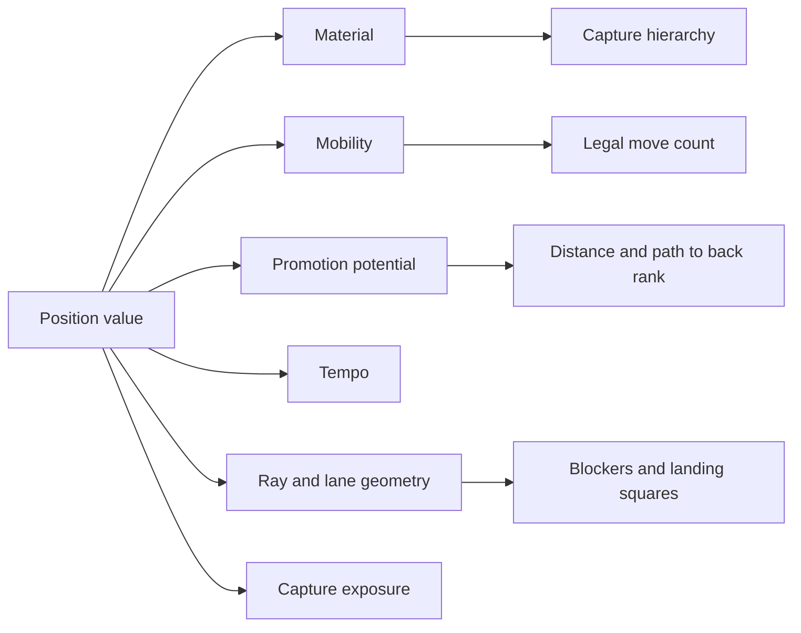
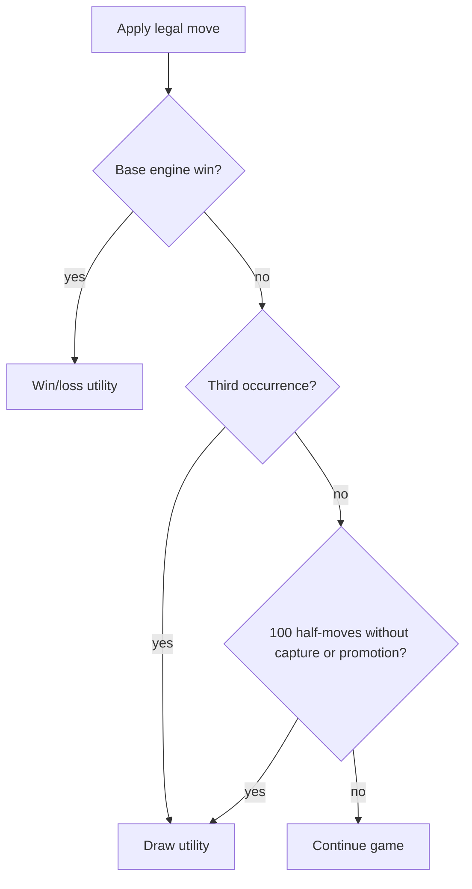

# Game theory of Raichu

**Status:** Canonical conceptual analysis. This document distinguishes proven structural properties from empirical strategy claims.

Raichu is best modeled as a finite-state, two-player, sequential, deterministic, perfect-information, adversarial game. With a symmetric utility assignment it is zero-sum. The local product rules add history-dependent draw conditions; the core engine alone does not.

## Formal model

Represent a position as:

\[
s = (B, p, h)
\]

where:

- `B` is the 8×8 board;
- `p` is the player to move; and
- `h` is the history information needed by the selected ruleset, such as repetition counts and the no-progress half-move counter.

For the core engine, `h` is omitted. For local draw-aware play, it is part of the state even though it is stored outside the board.

The legal action set is `A(s)`, generated from every piece owned by `p`. The deterministic transition function is:

\[
T(s, a) = s'
\]

where `a` moves one piece, optionally removes one enemy, optionally promotes, and changes the player to move.

A conventional terminal utility from White's perspective is:

\[
u(s) =
\begin{cases}
+1 & \text{White wins} \\
0 & \text{draw} \\
-1 & \text{Black wins}
\end{cases}
\]

The AI uses a larger numerical scale for search convenience, but that does not change the game-theoretic ordering.

## Classification

| Property | Raichu | Consequence |
|---|---|---|
| Players | Two | Alternating adversarial search applies. |
| Information | Perfect | Both players observe the full board and history available to the runtime. |
| Randomness | None in moves | Chance nodes are unnecessary; random color assignment happens before play, not inside the game tree. |
| Timing | Sequential | One player acts at a time. |
| Payoff | Zero-sum under symmetric scoring | One player's win is the other's loss; a draw is neutral. |
| State space | Finite | The board and side-to-move combinations are bounded. |
| Game graph | Cyclic without history rules | Quiet Raichu movement can repeat a position. |
| Branching | Position-dependent | Raichu rays can create many legal landing squares. |
| Observability | Complete | Strategy depends on calculation, not hidden information or bluffing. |

## Symmetry and first-move questions

The starting arrangement and movement rules are color-symmetric under a 180-degree board rotation plus a White/Black swap. That structural symmetry does not prove that the game value is a draw or that first move has no advantage.

White moves first, so the relevant balance question is empirical:

\[
\text{first-move advantage} = P(\text{White wins}) - P(\text{Black wins})
\]

Measure this separately by player rating, game mode, difficulty, and sample size. Random color assignment in ranked matchmaking reduces player-level bias but does not remove game-level first-move advantage.

## State-space intuition

A deliberately loose upper bound treats every cell as one of seven values (`.wW@bB$`) and adds the side to move:

\[
2 \times 7^{64}
\]

Most of those arrangements are unreachable because piece counts cannot increase, color and promotion histories constrain states, and legal movement preserves additional structure. The bound is useful only to show that exhaustive enumeration is impractical.

The practical search cost is driven by branching factor `b` and depth `d`:

\[
O(b^d)
\]

Alpha-beta pruning with strong move ordering can approach roughly `O(b^{d/2})` in favorable trees, but there is no guarantee because ordering and position shape vary.

## Strategic resources

Material is only one resource. A position's value emerges from interacting factors:

### Material and hierarchy

A Raichu dominates the capture hierarchy and has high mobility, but its realized value depends on open rays. A Pikachu may be immune to Pichu capture, and a Raichu is immune to both lower types. Therefore material value is not merely a count; type composition changes which exchanges are possible.

The shipped heuristic uses base material values of 100, 300, and 900. Those are engineering weights, not mathematically solved exchange rates.

### Mobility

Mobility is the size and quality of `A(s)`. A player with pieces but no legal action loses in the core engine. Restricting a high-value piece can therefore be as important as attacking it.

Useful mobility submetrics include:

- total legal moves;
- legal moves per piece;
- capture moves;
- safe promotion moves;
- distinct destination squares; and
- opponent mobility after the candidate move.

### Tempo

Because moves alternate and captures are optional, a threat has value only if the opponent cannot answer it in one move. A move that creates two incompatible threats has tactical leverage; a move that merely attacks a piece may lose tempo if the target can move while improving its own position.

### Promotion pressure

Promotion is a discontinuous increase in movement and capture power. Distance to the back rank is not enough: path availability, opponent control, and whether the promotion landing is tactically safe matter.

### Geometry

Raichu captures depend on empty landing squares beyond the target. A defender can reduce capture options by placing a second blocker behind a threatened piece or by using the board edge. Conversely, clearing a file or diagonal may increase a Raichu's action set dramatically.

## Optional capture and tactical consequences

Unlike forced-capture variants of checkers, Raichu permits quiet moves when a capture exists. This expands the action set and creates strategic refusal:

- decline a low-value capture to preserve promotion tempo;
- avoid landing on a tactically weak square;
- create a stronger double threat;
- keep a blocker in place; or
- manipulate repetition/no-progress state in draw-aware modes.

Because one move captures at most one piece and there are no chain jumps, tactics are naturally segmented into alternating decisions rather than forced multi-capture sequences.

## Terminal conditions and termination

The core engine ends a game when one side has no pieces or the next player has no legal moves. Its state graph can contain cycles because history is not part of the engine state.

The web local store augments state with:

- repetition counts keyed by encoded board plus side to move; and
- half-moves since capture or promotion.

It declares a draw on the third occurrence or after 100 half-moves without progress. With finite pieces and promotions, these history rules bound prolonged cyclic play in that runtime.

Online persistence currently has no `draw` status, so formal analyses of online play should not assume these local history rules are server-authoritative.

## Search model

The AI uses iterative-deepening minimax with alpha-beta pruning:

\[
V(s) =
\begin{cases}
u(s) & \text{terminal} \\
\max_{a \in A(s)} V(T(s,a)) & \text{root side to move} \\
\min_{a \in A(s)} V(T(s,a)) & \text{opponent to move}
\end{cases}
\]

At the depth limit, `V` is approximated by an evaluation function combining:

- material;
- advancement toward promotion; and
- centrality.

Captures and promotions are searched first to improve pruning. Iterative deepening returns the best result from the deepest fully completed iteration before the time budget.

### What the heuristic omits

The current evaluator does not directly price:

- mobility;
- threatened material;
- protected versus hanging pieces;
- promotion-path safety;
- repetition state;
- transpositions; or
- tactical instability at the depth horizon.

These omissions explain why a numerically favorable leaf can be strategically misleading. Quiescence search, transposition tables, and mobility terms are logical future experiments, not current features.

## Solved versus unsolved claims

The repository does not contain a proof of the game's theoretical value from the initial position. Do not claim that perfect play yields a White win, Black win, or draw.

Safe statements are:

- the rules define a deterministic perfect-information game;
- the reachable state space is finite;
- the history-free game graph may cycle;
- minimax is an appropriate adversarial search framework;
- current difficulty levels are bounded by time and depth, not by solved play; and
- balance must be measured empirically until stronger analysis exists.

## Research and telemetry questions

Useful analysis should record enough context to avoid misleading aggregates:

| Question | Required dimensions |
|---|---|
| Is White advantaged? | color, rating band, mode, sample size, version |
| Are promotions too decisive? | promotion ply, result, pre-promotion material, piece type |
| Does a piece dominate? | move share, capture share, survival, phase, rating band |
| Are games too long? | duration, move count, mode, abandonment, draw reason |
| Is AI difficulty calibrated? | human result, search depth, nodes, duration, position |
| Is matchmaking fair? | ELO gap, wait time, color assignment, result |

Statistical conclusions should include confidence intervals or uncertainty, not only point estimates.
