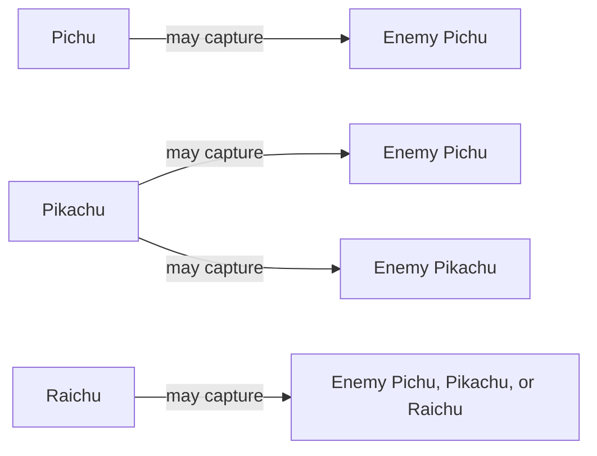
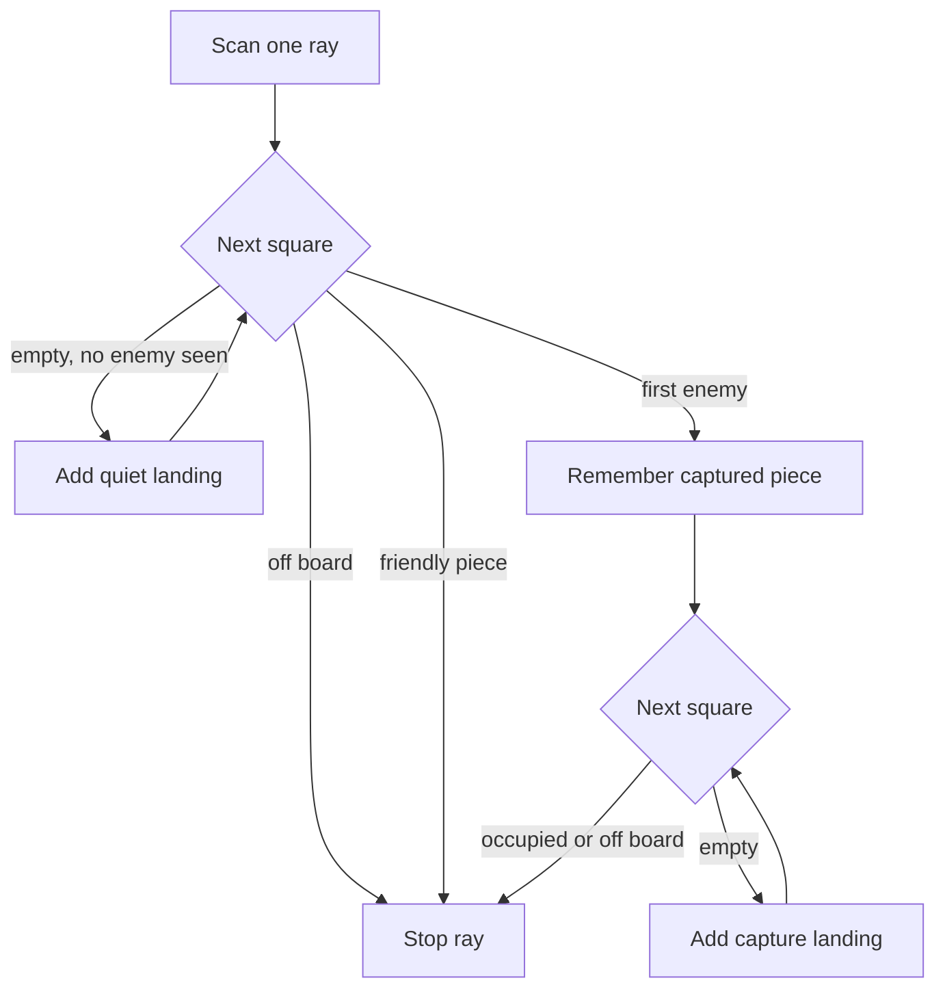
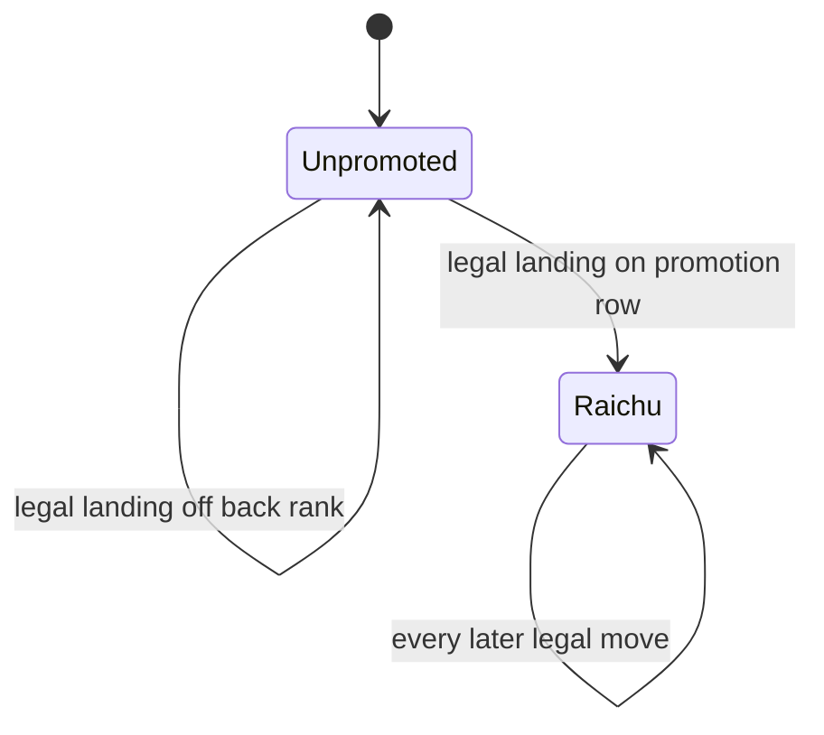
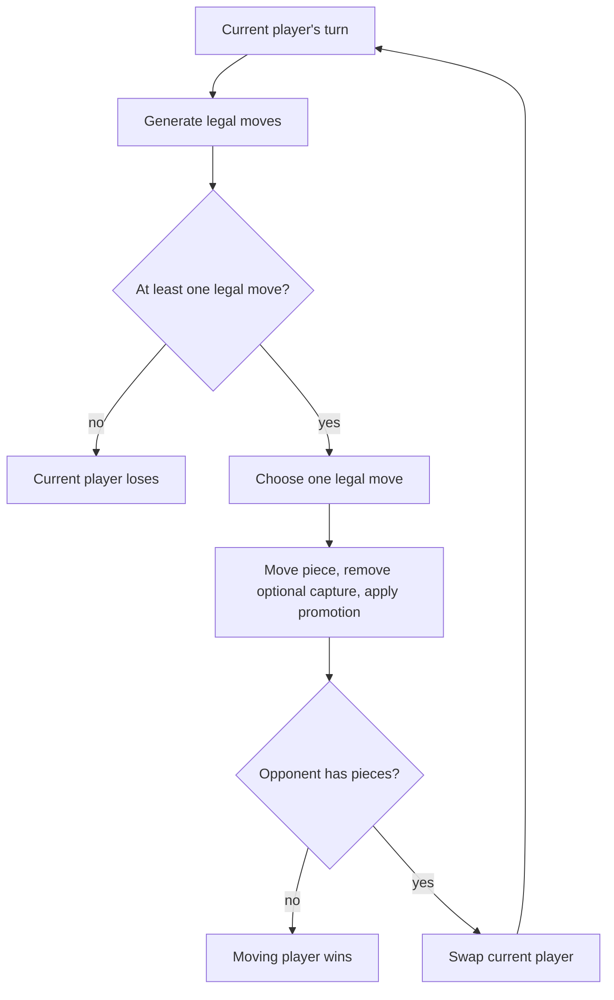

# Rules and notation

**Status:** Canonical game rules and representation guide.

Raichu is a deterministic, turn-based strategy game for two players on an 8×8 board. White moves first. Each player begins with four Pichus and four Pikachus; promoted pieces become Raichus.

For exact function signatures, see the [game engine reference](../GAME_ENGINE.md).

## Objective

Win by either:

1. capturing every opposing piece; or
2. leaving the opponent with no legal move when their turn begins.

There is no king and no check/checkmate concept. Captures are optional, and a move captures at most one piece.

## Board and coordinates

The implementation stores the board as `board[row][col]`, with zero-based coordinates.

- Row `0` is the top.
- Row `7` is the bottom.
- Column `0` is the left edge.
- White moves toward increasing row numbers.
- Black moves toward decreasing row numbers.

Human notation maps columns to `a`–`h` and displays ranks as `8 - row`. Therefore, `{ row: 0, col: 0 }` is `a8`, while `{ row: 7, col: 7 }` is `h1`.

### Initial position

```text
      a b c d e f g h
  8   . . . . . . . .   row 0
  7   W . W . W . W .   row 1
  6   . w . w . w . w   row 2
  5   . . . . . . . .   row 3
  4   . . . . . . . .   row 4
  3   b . b . b . b .   row 5
  2   . B . B . B . B   row 6
  1   . . . . . . . .   row 7
```

Uppercase letters are Pikachus, lowercase letters are Pichus, `@` and `$` are promoted Raichus, and `.` is empty.

## Piece encoding

| Piece | White | Black | Movement directions | Captures |
|---|---:|---:|---|---|
| Pichu | `w` | `b` | one diagonal step forward | enemy Pichu only |
| Pikachu | `W` | `B` | one or two squares forward, left, or right | enemy Pichu or Pikachu |
| Raichu | `@` | `$` | any distance along all eight rays | any enemy piece |
| Empty | `.` | `.` | — | — |

The hierarchy is strict:



A piece never captures a friendly piece. A lower-ranked piece cannot jump a higher-ranked enemy merely because the geometry would otherwise work.

## Pichu

### Quiet movement

A Pichu moves one square diagonally forward into an empty square:

- White: `(row + 1, col - 1)` or `(row + 1, col + 1)`.
- Black: `(row - 1, col - 1)` or `(row - 1, col + 1)`.

Pichus cannot move backward or sideways.

### Capture

A Pichu captures by jumping diagonally forward over an adjacent enemy Pichu and landing on the empty square immediately beyond it. The landing is two rows and two columns from the origin. It cannot capture a Pikachu or Raichu.

## Pikachu

### Quiet movement

A Pikachu moves one or two empty squares in exactly three directions:

- forward;
- left;
- right.

It cannot move diagonally or backward. A two-square move requires the intermediate square to be empty.

### Capture

A Pikachu captures an enemy Pichu or Pikachu along one of the same three directions:

- `P x .` — enemy one square away, land two squares away; or
- `P . x .` — first square empty, enemy two squares away, land three squares away.

The landing square must be in bounds and empty. A Pikachu cannot capture a Raichu.

## Raichu

A Raichu is ray-moving: it scans north, south, east, west, and all four diagonals.

### Quiet movement

It may land on any empty square before the first occupied square on a ray.

### Capture

If the first occupied square on a ray contains a capturable enemy, the Raichu may jump it and land on any empty square beyond it until another occupied square or the board edge. It captures exactly that one enemy.

If the first occupied square is friendly, or if a second occupied square is reached after an enemy, the ray stops.



## Promotion

A Pichu or Pikachu promotes immediately after landing on the opponent-facing back rank:

- White promotes on row `7`.
- Black promotes on row `0`.

The generated `Move` carries the promoted piece character, and `applyMove` places that character at the destination.



## Turn lifecycle



Captures are not mandatory. There are no multi-jump turns, en passant rules, castling rules, or check constraints.

## Move object

Every legal move is fully described:

```typescript
interface Move {
  from: { row: number; col: number };
  to: { row: number; col: number };
  piece: 'w' | 'W' | '@' | 'b' | 'B' | '$';
  captured?: {
    position: { row: number; col: number };
    piece: 'w' | 'W' | '@' | 'b' | 'B' | '$';
  };
  promotion?: '@' | '$';
}
```

Server validation uses generate-and-match: it generates the authoritative legal moves for the current player and matches the submitted origin and destination.

## Board serialization

Boards cross package and network boundaries as a 64-character row-major string:

```text
row 0 + row 1 + ... + row 7
```

Only `.wWbB@$` are valid cells. The REST bot endpoint additionally validates exact length and character set with Zod.

## Draw behavior by mode

Draws require special care because they are orchestrated above the core engine.

| Runtime | Current behavior |
|---|---|
| Core game engine | Returns `playing`, `white_wins`, or `black_wins`; it does not track history-based draws. |
| Web local PvP and bot | Adds threefold repetition and a 100-half-move no-capture/no-promotion rule. |
| iOS offline store | Implements the same repetition and half-move concepts. |
| Persisted online game schema | Stores `waiting`, `playing`, `white_wins`, `black_wins`, or `abandoned`; there is currently no persisted `draw` status. |

For analysis, always state which ruleset is being discussed. A claim about guaranteed termination is true for the local draw-augmented orchestration, but not for the history-free core engine graph, where repeated positions can cycle.

## Invariants

The following invariants should hold after every accepted move:

- The board remains 8×8 and every cell is a valid character.
- The origin becomes empty.
- The destination contains the moved or promoted piece.
- At most one captured square becomes empty.
- The moving piece belongs to the player whose turn it was.
- The next player is the opposite color.
- Original board arrays are not mutated by `applyMove`.
- A terminal piece-count or no-legal-move position is not advanced as though still playing.

These invariants are enforced primarily in `packages/game-engine` and covered by engine tests.
