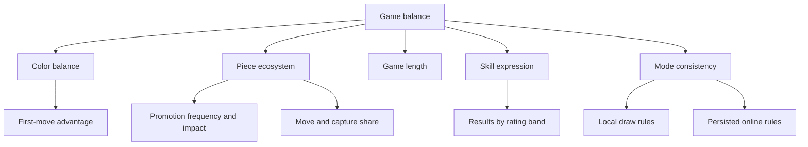

# Strategy and balance

**Status:** Canonical strategic framework and balance methodology. This is guidance, not a proof of optimal play.

Raichu strategy revolves around promotion races, capture hierarchy, mobility, and ray geometry. Since captures are optional, the best move often improves two resources rather than taking immediately available material.

## Strategic priorities

### 1. Preserve access to promotion

Promotion creates the strongest piece and changes the geometry of the board. Advance with a route, not just a direction:

- identify reachable promotion squares;
- count opponent replies;
- avoid lanes where a higher-ranked piece controls the landing; and
- consider whether moving a blocker opens an enemy Raichu ray.

### 2. Respect capture immunity

The hierarchy changes defensive value:

- a Pichu cannot remove a Pikachu or Raichu;
- a Pikachu cannot remove a Raichu; and
- only a Raichu can capture every enemy type.

A lower-ranked defender may attack squares without actually threatening the occupying higher-ranked piece. UI highlights and analysis must use legal capture generation rather than visual adjacency.

### 3. Measure mobility, not only material

A material lead can be irrelevant if the pieces are immobilized. Before choosing a move, compare:

\[
\Delta M = \text{your legal moves after} - \text{opponent legal moves after}
\]

This is not a complete evaluation, but it reveals moves that constrain the opponent while keeping options open.

### 4. Use blockers deliberately

For Raichu rays, the first and second occupied squares matter. A friendly blocker stops the ray; an enemy followed by no empty landing cannot be captured. A piece behind another can therefore be protection, congestion, or both.

### 5. Calculate the reply

One capture ends the turn. For each candidate move, inspect at least:

1. the opponent's captures;
2. the opponent's promotions;
3. threats to the moved piece; and
4. changes to open files and diagonals.

## Game phases

| Phase | Typical features | Main questions |
|---|---|---|
| Opening | crowded board, short-range pieces, low Raichu presence | Which lanes can develop without blocking promotion? Does White's first tempo matter? |
| Middlegame | captures open geometry, promotion threats appear | Can a threat gain material and tempo? Which exchange changes the hierarchy? |
| Endgame | sparse board, long Raichu rays, mobility dominates | Can the opponent be immobilized? Is repetition a resource in this mode? |

Phase boundaries are descriptive, not encoded rules.

## Tactical motifs

- **Promotion fork:** promote while attacking multiple pieces on new rays.
- **Landing-square denial:** occupy or control squares behind a target so a Raichu cannot complete a capture.
- **Hierarchy shield:** place a piece where nearby lower-ranked enemies cannot legally capture it.
- **Ray discovery:** move a blocker to expose a Raichu line.
- **Tempo refusal:** decline a capture to create a stronger promotion or immobilization threat.
- **Edge compression:** use the board boundary to reduce an enemy's landing choices.
- **Mobility trap:** leave enemy material on board but remove all legal actions.

## Balance model

Balance is multi-dimensional. A single global win rate cannot diagnose the cause of an issue.

### Primary metrics

| Metric | Interpretation | Guardrail |
|---|---|---|
| White win rate | possible first-move or setup advantage | segment by rating and mode |
| Promotion rate | how often the apex piece enters play | separate Pichu/Pikachu promotion |
| Win rate after first promotion | decisiveness of promotion | control for material before promotion |
| Median move count | pacing | distinguish completed and abandoned games |
| Capture rate | tactical density | do not equate more captures with higher quality |
| No-legal-move finishes | mobility importance | verify both clients and server detect consistently |
| Draw rate and reason | cyclic or defensive behavior | currently meaningful only where draw is implemented |
| ELO gap versus result | matchmaking calibration | include wait-expanded matches |

### Experimental process

1. State a falsifiable hypothesis.
2. Define the affected rules and modes.
3. Capture a version marker so old and new games are separable.
4. Run self-play and human-play samples.
5. Segment by color, rating, game length, and position phase.
6. Review confidence and qualitative replays.
7. Change one rule or weight at a time.
8. Re-run engine, API, and cross-platform contract tests.

Avoid balancing only against the current AI. An evaluation weakness can make a healthy rule appear unbalanced, while self-play between identical heuristics can hide shared blind spots.

## AI evaluation versus game balance

The AI's `100 / 300 / 900` material values are search parameters. Changing them changes bot behavior, not legal rules. A balance change affects what humans may do; an evaluation change affects what the bot prefers.

Keep experiments separated:

| Change | Category | Required validation |
|---|---|---|
| Pichu capture permission | Rules | engine fixtures, API validation, iOS bundle, replay compatibility |
| Raichu material weight | AI | search tests, benchmark positions, difficulty calibration |
| Matchmaking ELO window | Product system | queue simulations, latency and fairness telemetry |
| Draw threshold | Mode orchestration | history tests and online schema decision |

## Recommended benchmark position set

Maintain a versioned set of encoded positions covering:

- forced capture wins;
- safe versus unsafe promotions;
- mobility wins with material disadvantage;
- Raichu landing-square tactics;
- repeated positions;
- one-legal-move positions;
- symmetric positions for color inversion; and
- high-branching positions for performance.

For each position, record the side to move, expected legal moves, tactical expectation, and whether the expectation is proven or heuristic.

## Product consistency risks

The largest current balance-analysis risk is ruleset fragmentation:

- the core engine has no history-based draw;
- web local modes add two draw rules;
- the online database status has no draw value; and
- clients can calculate local history differently if events are missed.

Before drawing global conclusions from telemetry, identify the authoritative ruleset and version for every sample.
