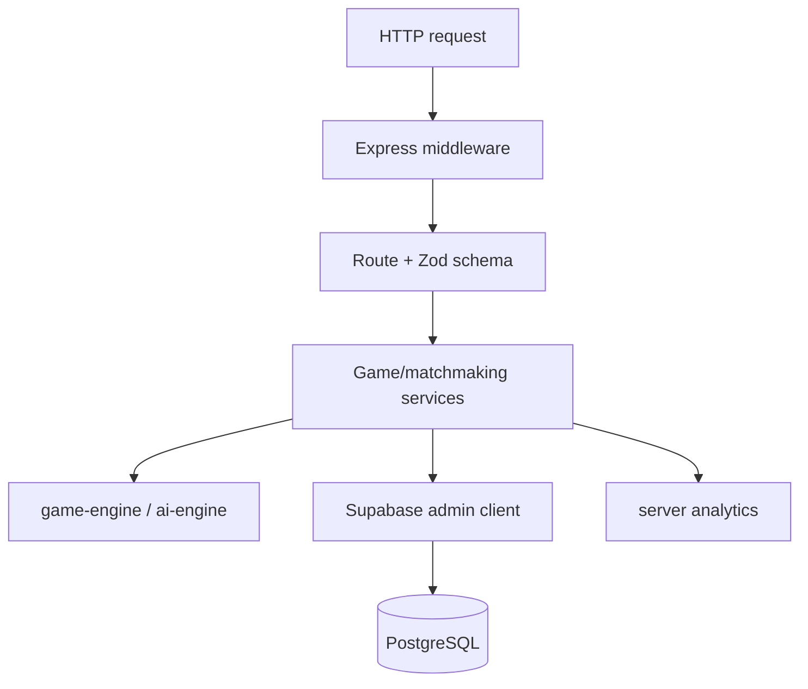

# API platform

**Status:** Canonical backend architecture guide. Endpoint payload details live in the [REST API reference](../API.md).

The API lives in `apps/api`. It is an Express 4 application built as a Node 22 CommonJS bundle with esbuild. It owns authoritative online commands, matchmaking, ELO updates, and server-side outcome analytics.

## Layering



| Layer | Responsibility |
|---|---|
| `index.ts` | process configuration, middleware and route mounting, worker startup |
| `routes/` | HTTP paths, schemas, status mapping, response shape |
| `middleware/` | JWT identity and final error handling |
| `lib/game-service.ts` | game use cases and persistence coordination |
| `lib/matchmaking*.ts` | queue operations, pairing policy, interval lifecycle |
| `lib/elo.ts` | pure rating math |
| `lib/supabase.ts` | service client and short-lived token cache |
| shared engines | deterministic legal moves and optional bot search |

## Endpoint groups

| Group | Authentication | Purpose |
|---|---|---|
| `GET /api/v1/health` | public | liveness response |
| `GET /api/v1/version` | public | API and engine version strings |
| `POST /api/v1/bot/move` | public | server-side search for a validated encoded board |
| `/api/v1/games/*` | Bearer JWT | create, join, list, read, move, resign |
| `/api/v1/matchmaking/*` | Bearer JWT | join, leave, and inspect ranked queue |

All game routes pass through `requireAuth`. The bot route validates board length, character set, player, difficulty, and optional positive time budget.

## Online move authority

The command checks, in order:

1. game exists;
2. game status is `playing`;
3. authenticated user is the player whose color has the turn;
4. submitted origin/destination matches a generated legal move;
5. new board and status are computed by the shared engine;
6. move history is inserted;
7. game snapshot and turn are updated; and
8. terminal statistics and ELO are updated when applicable.

Do not move legal geometry into route code. Route schemas protect shape; the game engine protects meaning.

## Authentication cache

The API maps tokens to verified `{ id, email }` identities for five minutes. It is:

- process-local;
- best-effort;
- cleared for an invalid token; and
- swept for expired entries when the map grows beyond 100 entries.

It is not a durable session store or a strict bounded LRU. Revocation can therefore take up to the cache TTL to affect a cached token.

## Matchmaking policy

The API process starts an interval only when Supabase is configured. Every five seconds it reads the queue oldest-first and pairs eligible users. The oldest player's wait controls the allowed ELO difference.

The client polls status separately every two seconds. A status request first checks queue membership; if absent, it searches for a recent ranked game involving that player.

### Operational assumption

The current worker design assumes one active pairing loop. Running several API replicas without coordination can create races. Before horizontal scaling, move matching behind a single worker, advisory lock, or transactional database function.

## ELO

Expected score:

\[
E_A = \frac{1}{1 + 10^{(R_B - R_A)/400}}
\]

Rating change:

\[
\Delta R = K(S - E)
\]

K-factor is 32 for fewer than 30 games, 24 for fewer than 100, and 16 afterward. The loser has a rating floor of 100. Only ranked games update ELO; friendly games can still update played/won counts.

## Error behavior

| Condition | Typical response |
|---|---:|
| Missing/invalid token | `401` |
| Auth provider unavailable | `503` |
| Invalid Zod body | `400` |
| Game not found on read | `404` |
| Wrong turn or illegal move | `400` |
| Unexpected service/database error | usually `500` |

The final error middleware hides details outside development. Some route handlers currently map service errors directly; avoid returning secrets or raw database diagnostics.

## Consistency limitations

The current implementation is not a transaction around a complete move:

- the move insert can succeed before the game update fails;
- profile and ELO updates span several calls;
- no idempotency key prevents duplicate client retries;
- no game version predicate rejects lost updates; and
- online base status currently omits `nextPlayer`, so immobility is not detected on that path.

Treat transactionality and optimistic concurrency as prerequisites before high-stakes competitive scaling.

## Security checklist for new routes

1. Decide public, optional-auth, or required-auth explicitly.
2. Validate every body, parameter, and bounded numeric value with Zod.
3. Check resource authorization, not only authentication.
4. Regenerate or load trusted state rather than accepting client snapshots.
5. Return a stable error shape without secret details.
6. Add rate limits for computationally expensive or abuse-prone public endpoints.
7. Add tests for malformed, unauthorized, cross-user, and replayed requests.
8. Update [API.md](../API.md) and shared contracts.

## Configuration and startup

```env
SUPABASE_URL=
SUPABASE_SERVICE_ROLE_KEY=
PORT=3001
NODE_ENV=development
```

If Supabase configuration is absent, the API starts with a placeholder client and disables the matchmaking interval; Supabase-backed requests will not function.

## Commands

```bash
pnpm --filter @raichu/api dev
pnpm --filter @raichu/api build
pnpm --filter @raichu/api test
pnpm check:supabase
```

## Related documents

- [REST API reference](../API.md)
- [Database reference](../DATABASE.md)
- [Runtime flows](../architecture/runtime-flows.md)
- [Data and Realtime](../engineering/data-and-realtime.md)
