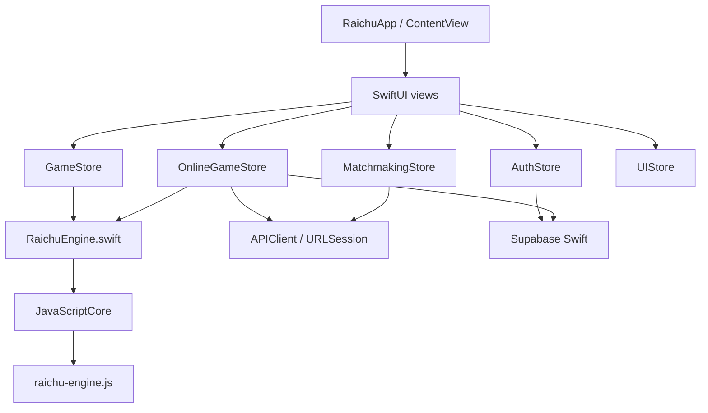
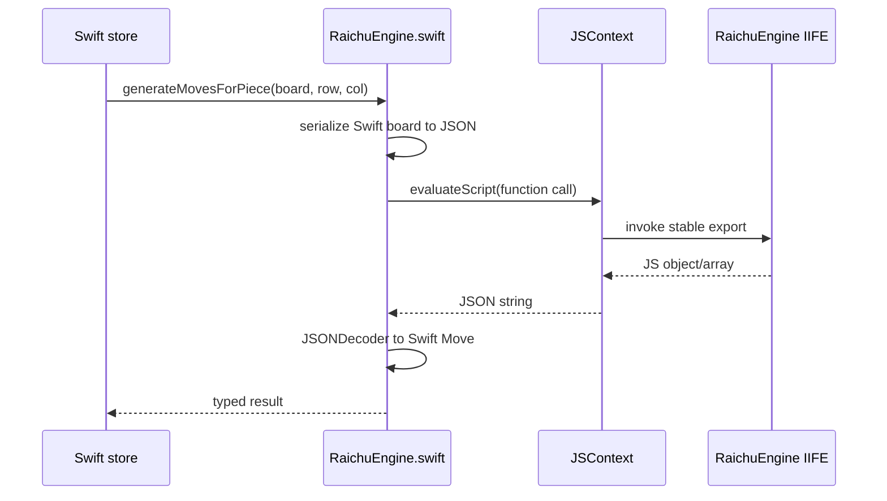
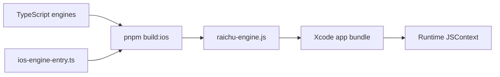
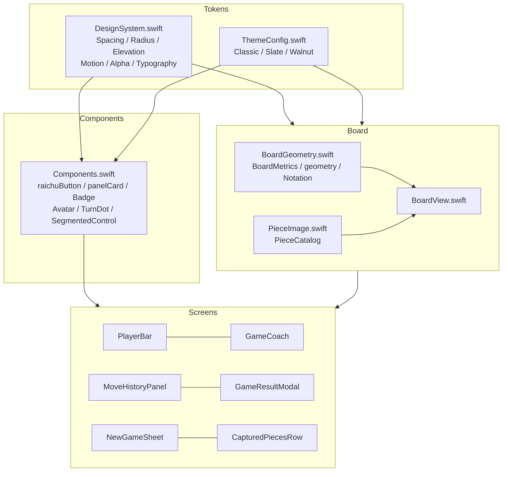
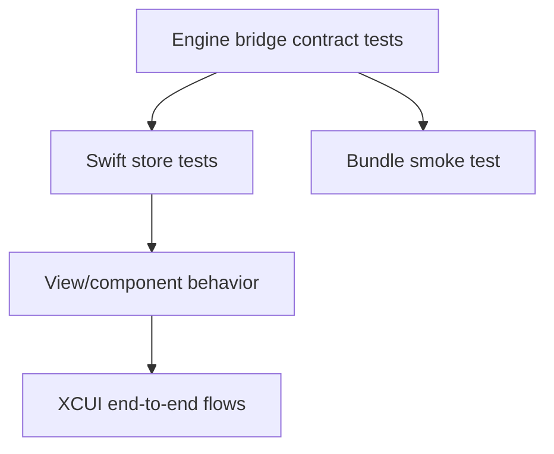

# iOS platform

**Status:** Canonical iOS architecture guide.

The native application is an iOS 26.2+ SwiftUI project at `apps/Ios-app/Raichu`. It reuses the deterministic TypeScript game and AI engines through JavaScriptCore while implementing native navigation, controls, haptics, themes, authentication, REST, and Realtime integration.

The phase-by-phase implementation workbook remains under [`docs/ios-workbook/`](../ios-workbook/00_PROJECT_OVERVIEW.md). This document is the stable architectural entry point. To continue the UI work, see the [iOS redesign master prompt](ios-redesign-master-prompt.md) and the current [redesign status and resume point](ios-redesign-status.md).

## Architecture

## Main directories

| Directory | Purpose |
|---|---|
| `Engine/` | Swift bridge, Codable board/move types, generated JS bundle |
| `Stores/` | offline game, online game, auth, matchmaking, and UI state |
| `Networking/` | typed REST client, Supabase configuration, reachability, notifications |
| `Views/` | feature screens (`Play/`, `Game/`, `Lobby/`, `Home/`, `History/`, `Leaderboard/`, `Profile/`, `Auth/`) |
| `Views/Shared/` | design tokens, shared components, board geometry and board rendering — see [UI system](#ui-system) |
| `Assets.xcassets/` | app identity and bundled piece images |
| `RaichuTests/` | Swift Testing unit targets |
| `RaichuUITests/` | XCUIAutomation flows |

## Engine bridge

The bridge loads `raichu-engine.js` from the app bundle. If it is unavailable, a stub IIFE supplies the starting board and empty/no-op behavior for UI development. A stub-loaded app is not a functional game and must never be mistaken for engine verification.

### Stable exports

The bundle global is `RaichuEngine` and exposes exactly:

- `createInitialBoard`
- `encodeBoard`
- `decodeBoard`
- `generateMovesForPiece`
- `generateAllMoves`
- `applyMove`
- `getGameStatus`
- `findBestMove`

These names are called through runtime strings. Renaming one can compile successfully and fail only at runtime.

## Build boundary

The build script and entry point are protected contracts. Do not:

- add a `package.json` under `apps/Ios-app`;
- add the native project or scripts to Turbo;
- change the IIFE/global/main-field flags;
- rename the eight exports; or
- manually commit the generated bundle.

CI runs `pnpm build:ios` after the monorepo build and uploads the bundle as `raichu-engine-js`.

## Stores

| Store | Responsibility |
|---|---|
| `GameStore` | offline board, selection, moves, draw history, bot trigger |
| `OnlineGameStore` | persisted game, REST commands, Realtime refresh, polling fallback |
| `AuthStore` | Supabase session and profile state |
| `MatchmakingStore` | ranked queue and two-second status polling |
| `UIStore` | theme, orientation, replay, sound/haptic preferences |

Stores that update views are `@MainActor`. New asynchronous work should use Swift async/await and structured `Task` lifecycles; do not add Combine pipelines.

## Offline flow

`GameStore` asks the bridge for legal moves and board transformations. It tracks repetition and no-progress state in Swift because those are not in the position-only engine API. Bot search currently calls the bundled AI through JSContext and then applies the returned move.

## Online flow

`APIClient` uses `URLSession.data(for:)`, JSON `Codable` types, and an optional Bearer token. Feature wrappers provide game and matchmaking calls.

`OnlineGameStore`:

1. loads the game and moves through REST;
2. determines the signed-in player's color;
3. sends move commands to the API;
4. subscribes to `games` updates and `moves` inserts;
5. refreshes authoritative details when events arrive; and
6. polls every three seconds as a fallback.

## Configuration

- Supabase project URL is defined in `SupabaseClient.swift`.
- The anon key is read from the Xcode scheme environment variable `SUPABASE_ANON_KEY`.
- Debug REST base URL is local; release uses the production same-origin API path.
- Never commit a real service-role or anon secret into source.

The Supabase anon key is designed to be distributable, but using environment/config injection still avoids accidental project mix-ups and keeps placeholders out of releases.

## UI system

Everything shared by the game screens lives in `Views/Shared/`. It is a layered
system: tokens at the bottom, generic components above them, then board-specific
machinery, then the screen-composition pieces. Screens compose these; they do not
re-declare padding, corner radius, backgrounds, or animation curves inline.

### Token layer

| File | Owns |
|---|---|
| `DesignSystem.swift` | `Spacing`, `Radius`, `Elevation`, `Motion`, `Alpha`, `Typography` |
| `ThemeConfig.swift` | colour only — Classic (`#769656`), Slate (`#3b82f6`), Walnut (`#e07040`) |

These mirror the web (`apps/web/src/app/globals.css`, `apps/web/src/lib/themes.ts`).
**The web is canonical when the two drift.** `Radius` values are named for the
component they belong to rather than forming a 4/8/16 ramp, because the web's
scale is per-component. `Alpha` encodes the hex-alpha bytes the web appends to
colours (`accent + '22'`) so the Swift reads as the same intent as the CSS.

Type is SF Pro rather than the web's Figtree: every `Typography` style is
relative to a system text style, so Dynamic Type and VoiceOver sizing come free
and SF tracks Figtree closely at UI sizes.

**Motion uses two bespoke curves and no springs**, matching the web:

| Curve | CSS | Used for |
|---|---|---|
| `Motion.arrive` | `cubic-bezier(0.16, 1, 0.3, 1)` | arrivals, dialogs, piece slides, drag settles |
| `Motion.press` | `cubic-bezier(0.2, 0.8, 0.2, 1)` | presses, legal-move dots |

A SwiftUI spring reads visibly bouncier than the web and breaks the family
resemblance, so do not introduce one. Named durations on `Motion` are lifted
from the web keyframes.

These two are the only *custom* curves. Where the web's own keyframes use a plain
CSS easing, iOS uses the matching SwiftUI easing rather than forcing a bespoke
curve — for example `.last-move-square` is `180ms ease-out` in `globals.css`, so
`BoardView` animates `lastMove` with `.easeOut(duration: Motion.lastMoveIn)`, and
the repeating turn/thinking pulses are `ease-in-out` on both clients. Do not
"correct" those to `Motion.arrive` / `Motion.press`: it would break the parity it
looks like it is restoring. The rule is *no springs, and no curve that the web
does not also use for that animation.*

### Component layer

`Components.swift` provides the chrome every screen reuses: `.raichuButton(_:theme:)`
(`primary` / `secondary` / `destructive` / `dock`), `.panelCard(theme:)`, plus
`DockLabel`, `Badge`, `RaichuSegmentedControl`, `Avatar`, `TurnDot`, and
`PieceColorDot`.

### Board layer

`BoardGeometry.swift` is the single owner of board maths and must not be
re-derived inline:

- Proportions match the web SVG — a 512pt board with 20pt gutters left, top and
  bottom (`532 × 552`); piece size is `square * 0.9375` (the web's 60/64).
- `whiteAtBottom` (`UIStore.boardFlipped`, default `true`) puts White's home rank
  at the bottom. Flipping is a 180-degree rotation, so one involution maps both
  axes in both directions.
- `Notation` is the only place the square naming is written down:
  `{row: 0, col: 0} == a8`, file `abcdefgh[col]`, rank `8 - row`
  (see [game rules and notation](../game/rules-and-notation.md)).

`BoardView` composes layers in the same order as the web SVG: squares → last
move → selection → legal targets → coordinates → static pieces → move flight →
dragged piece. Two details are deliberate and load-bearing:

- **Squares are tapped through per-square targets, not a container gesture.** A
  container `DragGesture(minimumDistance: 0)` doing its own hit-testing loses every
  tap after the first to the enclosing `TabView`, and per-square targets also give
  VoiceOver a real element to select.
- **Piece slides come from an explicit flight overlay**, ported from the web's
  `PieceMoveOverlay.tsx`, because a `[[String]]` board carries no stable piece
  identity for SwiftUI to diff. Duration is distance-aware
  (`min(0.24, 0.135 + squares * 0.018)`), and the flight is suppressed for drag
  moves since the piece is already under the finger. The captured piece fades where
  it stood — which is not always the destination, since Raichu captures by jumping.

`PieceImage` / `PieceCatalog` load the bundled Chess.com Neo pieces with a CDN
fallback (`w→wp b→bp W→wr B→br @→wq $→bq`). Never substitute unicode chess glyphs.

### Screen composition

| Component | Web counterpart |
|---|---|
| `PlayerBar` | `.player-bar` / `.player-bar-compact` |
| `GameCoach` | `GameCoach.tsx` — contextual strip for the first two half-moves |
| `MoveHistoryPanel` | `MoveHistory.tsx` — collapsed by default with a `Last:` preview |
| `GameResultModal` | `.game-result-dialog` |
| `NewGameSheet` | `.new-game-dialog` |
| `CapturedPiecesRow` | captured-piece tray |

`MoveNotation` ports `formatMoveHuman` / `formatMoveCoordinate` from
`packages/game-engine/src/game.ts` so move lists read identically on both clients,
and adds a `spoken` form for VoiceOver. `Constants.swift` holds cross-client
product constants — currently `BotIdentity.name` ("Jarvis"), mirroring the web's
`BOT_NAME`.

`HapticManager` centralizes tactile feedback; `UIStore` persists theme, board
orientation, sound, and haptic choices in `UserDefaults`.

Use native hit testing, VoiceOver labels, Dynamic Type where text appears,
sufficient contrast, and reduced-motion-aware animations — the web zeroes all
animation under `prefers-reduced-motion`, and iOS honours
`accessibilityReduceMotion` the same way.

### Known divergence from web

The web's board coordinate labels are inverted in its default orientation:
`Board.tsx` draws rank `i + 1` and file `COL_LABELS[7 - i]` against board row/col
`i`, so its labels disagree with the move notation in its own move list. iOS
deliberately does **not** copy this — `Notation` renders the canonical `a8`
mapping so coordinates and move history agree. Fixing the web is tracked
separately; do not "restore parity" by re-introducing the bug.

## Testing strategy

Highest-priority tests:

- all eight bridge functions return decodable results;
- known board fixtures match TypeScript engine output;
- missing bundle behavior is detectable;
- move/promotion/capture JSON round-trips;
- stale async bot work cannot mutate a restarted game;
- online refresh converges after a missed event;
- matchmaking polling cancels on leave/deinit; and
- VoiceOver can identify player, square, piece, and legal action.

### UI suites

A green build is not a pass. Every regression found during the UI redesign was
invisible to the compiler — a board that rendered nothing, an orientation that was
upside down, taps that stopped working after the first one. `simctl` cannot tap, so
interaction is driven from XCUIAutomation:

| Suite | Covers |
|---|---|
| `BoardInteractionUITests` | finds the board by its `"Game board"` accessibility label, computes square centres from its frame, and drives select → legal targets → completed move |
| `RedesignScreenshotUITests` | captures the new-game sheet, guide, lobby and auth surfaces for visual review |
| `AccessibilityAuditUITests` | one `performAccessibilityAudit` per screen/state — contrast, Dynamic Type, clipped text, hit regions, element descriptions |

The first two attach screenshots. Extract them with
`xcrun xcresulttool export attachments --path <...>.xcresult --output-path ./att`;
`manifest.json` maps attachment names to files. Verify board orientation against
the engine rather than intuition — `RaichuEngine.createInitialBoard()` puts White
on rows 1–2 and Black on rows 5–6.

### Accessibility audits

`performAccessibilityAudit` audits the current view exactly as the Accessibility
Inspector does and fails the test on findings, so the tests assert nothing. Audits
see only what is on screen — hence one test per screen/state, and
`continueAfterFailure = true` so a run surfaces every finding at once.

Two constraints are encoded in the suite and worth knowing before editing it:

- **Board screens name their audit types.** The board publishes 64 tap targets, and
  auditing them exceeds the audit's own budget (`Audit failed to complete in
  time`) — `.contrast` is the expensive check, since it samples pixels per element.
  Board tests use `[.sufficientElementDescription, .textClipped]`; the shared
  chrome is contrast-checked on the other screens instead.
- **Accepted findings are filtered in `isAccepted`, each with its reason** — never
  by disabling an audit type, so a new regression in the same category still fails.
  Currently accepted:
  - `.dynamicType` on board coordinate glyphs and avatar initials — single
    characters sized as a fraction of a geometrically fixed container; the
    information is reachable through each square's own label.
  - `.dynamicType` reported as *partially* unsupported on `.caption2`-based styles
    (`Typography.captionSmall`, `.kicker`). These do scale; `.caption2` is simply
    the smallest system style and tops out below the largest accessibility size.
    Fully-unsupported findings still fail.
  - `.hitRegion` on board squares — a square is `board / 8`, and VoiceOver
    activates a labelled element rather than aiming at one.
  - `.contrast` reported as *nearly passed* — see below. Outright `Contrast failed`
    still fails.

**Open decision — accent contrast.** `theme.accent` against its own tint, and white
on `theme.accent`, measure ≈3.4:1. That clears the 3:1 bar for large text but not
4.5:1 for body text, so the audit reports `Contrast nearly passed` on the avatar
initials, the turn pill, badges and the primary buttons. The accent is mirrored from
`apps/web/src/lib/themes.ts` and is canonical, so raising it is a product decision
spanning both clients rather than a local iOS fix. It is filtered in `isAccepted`
with a `TODO(contrast)` so it stays visible.

Audits are the floor, not the ceiling: they complement manual VoiceOver and
Dynamic Type passes rather than replacing them.

## Current risks

| Risk | Consequence | Mitigation direction |
|---|---|---|
| String-evaluated JavaScript calls | runtime-only contract failures and escaping concerns | typed wrapper tests and safer JSValue invocation |
| Stub fallback is silent | UI can appear healthy without rules | explicit development banner/engine health state |
| Synchronous JS search | long AI search can occupy the main actor | dedicated JS context/worker queue or native concurrency boundary |
| Platform draw logic | divergence from web/API | shared session-state contract |
| Realtime plus polling | duplicate refreshes and lifecycle complexity | idempotent state application and connection health tests |

## Related documents

- [Monorepo architecture](../architecture/monorepo.md)
- [Game engine](../GAME_ENGINE.md)
- [iOS implementation workbook](../ios-workbook/00_PROJECT_OVERVIEW.md)
- [Testing, security, and operations](../engineering/testing-security-operations.md)
