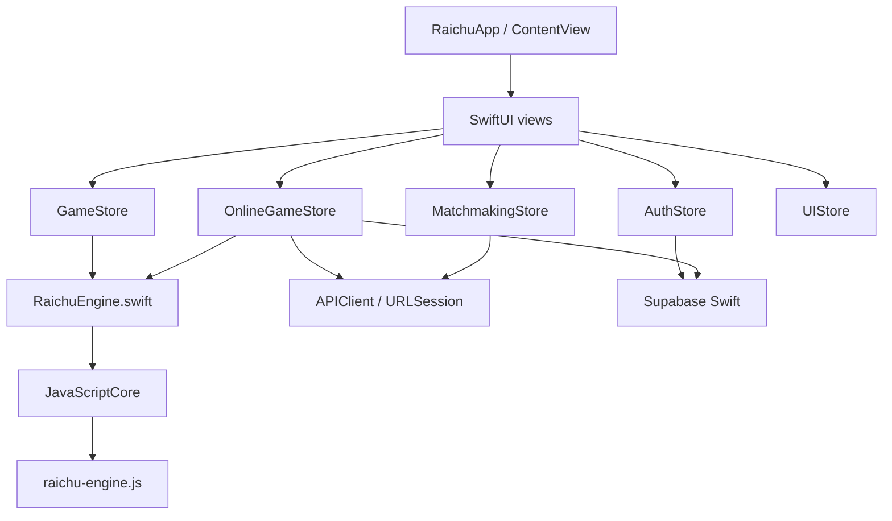
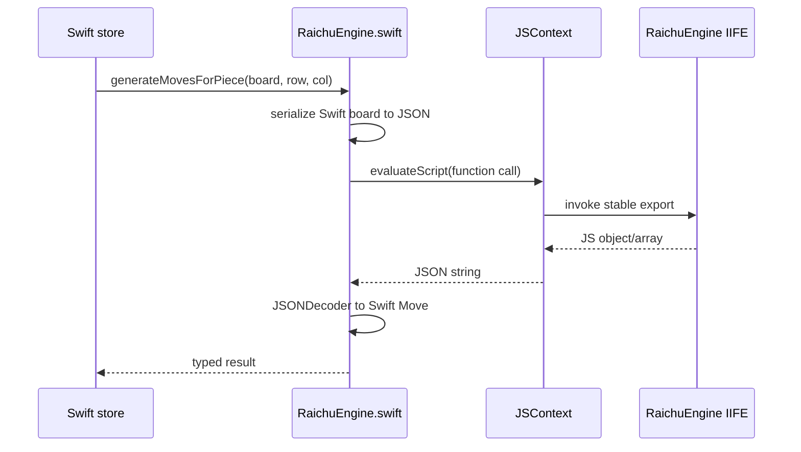
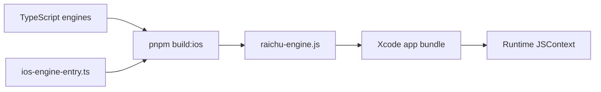
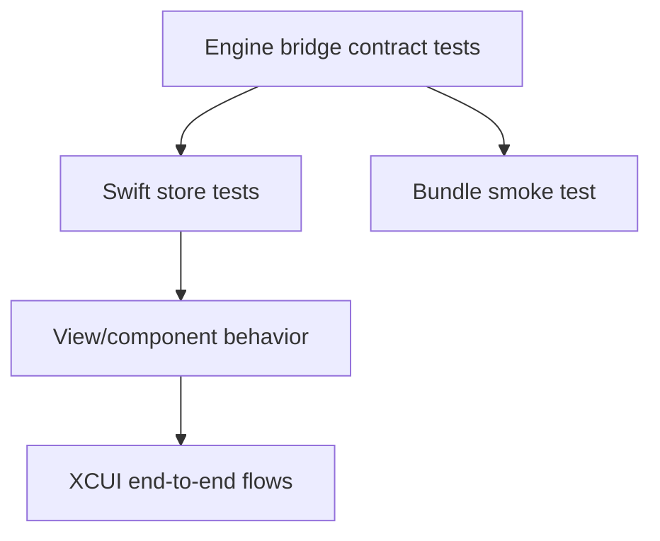

# iOS platform

**Status:** Canonical iOS architecture guide.

The native application is an iOS 17+ SwiftUI project at `apps/Ios-app/Raichu`. It reuses the deterministic TypeScript game and AI engines through JavaScriptCore while implementing native navigation, controls, haptics, themes, authentication, REST, and Realtime integration.

The phase-by-phase implementation workbook remains under [`Raichu/ios app/`](../../apps/Ios-app/Raichu/Raichu/ios%20app/00_PROJECT_OVERVIEW.md). This document is the stable architectural entry point.

## Architecture

## Main directories

| Directory | Purpose |
|---|---|
| `Engine/` | Swift bridge, Codable board/move types, generated JS bundle |
| `Stores/` | offline game, online game, auth, matchmaking, and UI state |
| `Networking/` | typed REST client, Supabase configuration, reachability, notifications |
| `Views/` | feature screens and shared board/piece/theme components |
| `Assets.xcassets/` | app identity and bundled piece images |
| `RaichuTests/` | Swift Testing unit targets |
| `RaichuUITests/` | XCUIAutomation flows |

## Engine bridge

The bridge loads `raichu-engine.js` from the app bundle. If it is unavailable, a stub IIFE supplies the starting board and empty/no-op behavior for UI development. A stub-loaded app is not a functional game and must never be mistaken for engine verification.

### Stable exports

The bundle global is `RaichuEngine` and exposes exactly:

- `createInitialBoard`
- `encodeBoard`
- `decodeBoard`
- `generateMovesForPiece`
- `generateAllMoves`
- `applyMove`
- `getGameStatus`
- `findBestMove`

These names are called through runtime strings. Renaming one can compile successfully and fail only at runtime.

## Build boundary

The build script and entry point are protected contracts. Do not:

- add a `package.json` under `apps/Ios-app`;
- add the native project or scripts to Turbo;
- change the IIFE/global/main-field flags;
- rename the eight exports; or
- manually commit the generated bundle.

CI runs `pnpm build:ios` after the monorepo build and uploads the bundle as `raichu-engine-js`.

## Stores

| Store | Responsibility |
|---|---|
| `GameStore` | offline board, selection, moves, draw history, bot trigger |
| `OnlineGameStore` | persisted game, REST commands, Realtime refresh, polling fallback |
| `AuthStore` | Supabase session and profile state |
| `MatchmakingStore` | ranked queue and two-second status polling |
| `UIStore` | theme, orientation, replay, sound/haptic preferences |

Stores that update views are `@MainActor`. New asynchronous work should use Swift async/await and structured `Task` lifecycles; do not add Combine pipelines.

## Offline flow

`GameStore` asks the bridge for legal moves and board transformations. It tracks repetition and no-progress state in Swift because those are not in the position-only engine API. Bot search currently calls the bundled AI through JSContext and then applies the returned move.

## Online flow

`APIClient` uses `URLSession.data(for:)`, JSON `Codable` types, and an optional Bearer token. Feature wrappers provide game and matchmaking calls.

`OnlineGameStore`:

1. loads the game and moves through REST;
2. determines the signed-in player's color;
3. sends move commands to the API;
4. subscribes to `games` updates and `moves` inserts;
5. refreshes authoritative details when events arrive; and
6. polls every three seconds as a fallback.

## Configuration

- Supabase project URL is defined in `SupabaseClient.swift`.
- The anon key is read from the Xcode scheme environment variable `SUPABASE_ANON_KEY`.
- Debug REST base URL is local; release uses the production same-origin API path.
- Never commit a real service-role or anon secret into source.

The Supabase anon key is designed to be distributable, but using environment/config injection still avoids accidental project mix-ups and keeps placeholders out of releases.

## UI system

- `BoardView` renders the 8×8 grid and delegates rule decisions to stores/bridge.
- `PieceImage` loads bundled Neo piece assets with CDN fallback.
- `ThemeConfig` defines Classic, Slate, and Walnut themes through SwiftUI environment values.
- `HapticManager` centralizes tactile feedback.
- `UIStore` persists theme, sound, and haptic choices in `UserDefaults`.

Use native hit testing, VoiceOver labels, Dynamic Type where text appears, sufficient contrast, and reduced-motion-aware animations.

## Testing strategy

Highest-priority tests:

- all eight bridge functions return decodable results;
- known board fixtures match TypeScript engine output;
- missing bundle behavior is detectable;
- move/promotion/capture JSON round-trips;
- stale async bot work cannot mutate a restarted game;
- online refresh converges after a missed event;
- matchmaking polling cancels on leave/deinit; and
- VoiceOver can identify player, square, piece, and legal action.

## Current risks

| Risk | Consequence | Mitigation direction |
|---|---|---|
| String-evaluated JavaScript calls | runtime-only contract failures and escaping concerns | typed wrapper tests and safer JSValue invocation |
| Stub fallback is silent | UI can appear healthy without rules | explicit development banner/engine health state |
| Synchronous JS search | long AI search can occupy the main actor | dedicated JS context/worker queue or native concurrency boundary |
| Platform draw logic | divergence from web/API | shared session-state contract |
| Realtime plus polling | duplicate refreshes and lifecycle complexity | idempotent state application and connection health tests |

## Related documents

- [Monorepo architecture](../architecture/monorepo.md)
- [Game engine](../GAME_ENGINE.md)
- [iOS implementation workbook](../../apps/Ios-app/Raichu/Raichu/ios%20app/00_PROJECT_OVERVIEW.md)
- [Testing, security, and operations](../engineering/testing-security-operations.md)
