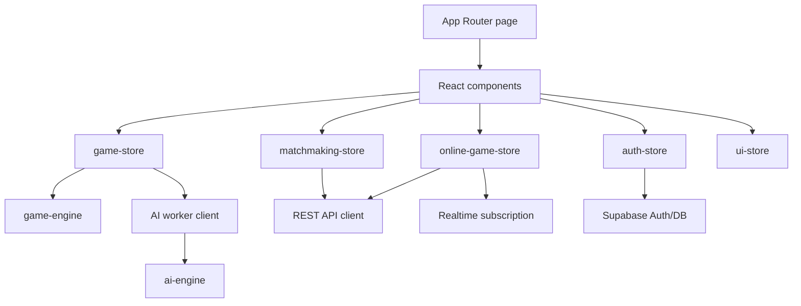
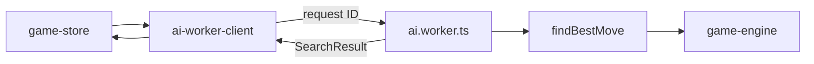

# Web platform

**Status:** Canonical web architecture guide.

The web application lives in `apps/web`. It uses Next.js 16 App Router, React 19, TypeScript, Zustand, Framer Motion, Tailwind CSS, and Supabase browser/server clients.

## Responsibilities

- Render public, SEO, authentication, local play, online play, lobby, history, leaderboard, profile, puzzles, and analytics pages.
- Orchestrate local PvP and bot games.
- Run bot search away from the render thread.
- Manage authentication and profile UX.
- Send authenticated online commands to the API.
- Subscribe to online game changes and recover through polling.
- Capture privacy-aware product analytics.

## Route groups

| Area | Representative routes | Rendering purpose |
|---|---|---|
| Marketing and discovery | `/`, `/rules`, `/how-to-play`, `/strategy`, `/faq`, `/blog/*` | mostly static, indexed content |
| Local play | `/play` | client-driven board, bot, local history |
| Online play | `/lobby`, `/game/[id]`, `/join/[code]` | authenticated commands and Realtime state |
| Account | `/auth`, `/profile`, `/history`, `/leaderboard` | Supabase-backed user data |
| Operations | `/admin/analytics` | server-only service-role aggregates |
| Server routes | `/api/track`, `/auth/callback` | analytics ingestion and OAuth exchange |

Next.js rewrites `/api/:path*` to the configured Express origin, allowing browser code to use same-origin-looking paths.

## Component and state flow



## Zustand stores

| Store | Owns | Important actions |
|---|---|---|
| `game-store` | local board, turn, history, draw counters, bot config, thinking state | select, move, new game, restart, request bot move |
| `online-game-store` | current persisted game, decoded board, moves, identity color, optimistic interaction state | load, submit, resign, handle Realtime events |
| `auth-store` | Supabase user, profile, loading and auth errors | initialize, sign up/in/out, OAuth, update/fetch profile |
| `matchmaking-store` | queue status, wait, queue count, match ID | join, leave, poll, reset |
| `ui-store` | theme, dragging, board flip, new-game dialog, mobile history, replay | setters and replay navigation |

Store separation is by product responsibility. Components should subscribe to the smallest state slices they render to avoid unnecessary board re-renders.

## Local game lifecycle

The local store begins as an easy bot game with the human playing White. A new-game dialog can select local PvP, bot difficulty/color, or redirect to online lobby.

After each local move the store:

1. applies the immutable engine transition;
2. computes base status with the next player;
3. updates move and board history;
4. updates threefold and no-progress draw counters;
5. emits completion analytics when terminal; and
6. schedules a bot reply when appropriate.

## AI worker



The client keeps one worker instance and a map of pending request IDs. It rejects searches on worker error, enforces a ten-second request timeout, and discards stale results through a store-level search ID when a game is restarted or superseded.

## Board interaction and motion

The board supports tap-to-move and drag-to-move. Its interaction system includes:

- `BoardContext` for shared board geometry/state;
- `useSmoothPieceDrag` for pointer tracking;
- `PieceMoveOverlay` and `usePieceMoveAnimation` for transform-based movement;
- legal destination and capture highlights;
- last-move visualization;
- replay mode; and
- piece assets consistent with the visual theme.

Motion should prefer transforms and opacity, avoid layout-triggering per-frame changes, and honor `prefers-reduced-motion`.

## Responsive design model

Mobile is treated as a game surface, not a compressed desktop sidebar:

- the board remains the visual priority;
- player state surrounds the board;
- controls become touch-sized actions;
- move history collapses with a latest-move preview;
- new-game configuration becomes a bottom sheet; and
- nonessential content moves behind progressive disclosure.

Desktop uses a board-plus-sidebar layout. Breakpoints must be validated at compact phone height as well as phone width because modal footer reachability is height-sensitive.

## Accessibility contract

- Dialogs use `role="dialog"`, `aria-modal`, labels/descriptions, focus trapping, Escape close, and focus restoration.
- Interactive board controls require descriptive labels in addition to color highlights.
- Touch targets should be at least approximately 44 CSS pixels where layout permits.
- Keyboard users must be able to configure, start, replay, and restart a game.
- Live status such as bot thinking and guidance uses polite announcements.
- Reduced-motion users receive functionally equivalent state changes without decorative animation.

## Online data path

`apiFetch` obtains the current Supabase access token, attaches it as a Bearer token, normalizes non-2xx responses, and records API failures. `gamesApi` builds game commands on top of it.

`useGameSubscription` listens for `games` updates and `moves` inserts. It also compares REST-fetched board/status state every three seconds when recovery is needed.

## Analytics

The web analytics client records page, auth, game, matchmaking, Realtime, error, and performance events. `/api/track` performs server-side enrichment and inserts with the service role. Offline games emit summaries instead of one row per move.

Never send secrets, complete access tokens, raw IP addresses, or free-form sensitive user content as analytics properties.

## Configuration

```env
NEXT_PUBLIC_SUPABASE_URL=
NEXT_PUBLIC_SUPABASE_ANON_KEY=
SUPABASE_SERVICE_ROLE_KEY=
NEXT_PUBLIC_API_URL=http://localhost:3001
NEXT_PUBLIC_SITE_URL=http://localhost:3000
ANALYTICS_IP_SALT=
```

Only variables prefixed with `NEXT_PUBLIC_` enter client bundles. The service role and analytics salt are server-only.

## Testing expectations

At minimum, web changes should cover the relevant mix of:

- Vitest store and utility tests;
- strict TypeScript through production build;
- responsive browser checks at desktop, phone, and compact phone sizes;
- keyboard and focus-flow checks;
- horizontal overflow checks; and
- production build route generation.

Run:

```bash
pnpm --filter @raichu/web test
pnpm --filter @raichu/web build
```

## Common failure modes

| Symptom | Likely layer |
|---|---|
| Board freezes only during bot turn | worker creation, worker error, stale search, or timeout |
| Online move rejected | session, turn ownership, stale game state, or engine validation |
| Opponent move appears after delay | Realtime connection; polling recovery should converge |
| Modal action inaccessible on small phone | height constraint/internal scrolling/footer layout |
| Hydration mismatch | server/client-only state read during render |
| Admin analytics exposes/fails data | server environment or secured view permissions |

## Related documents

- [Runtime flows](../architecture/runtime-flows.md)
- [Game engine](../GAME_ENGINE.md)
- [Data and Realtime](../engineering/data-and-realtime.md)
- [Testing, security, and operations](../engineering/testing-security-operations.md)
