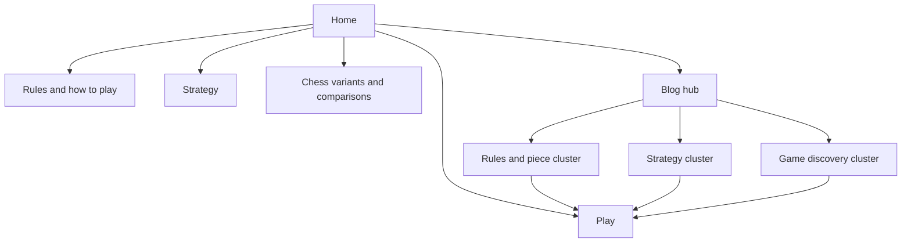
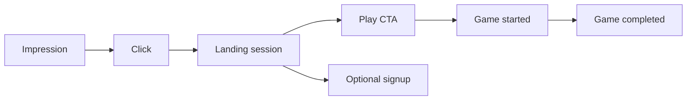

# SEO and content system

**Status:** Canonical product-specific SEO and content guide.

Raichu's acquisition surface combines playable product routes, evergreen rules/strategy pages, comparison pages, and an educational blog. This guide is grounded in the checked-in Next.js site.

## Search architecture

Every informational page should answer its query directly, link to the most relevant deeper guide, and offer a contextual path to play without overwhelming the article.

## Canonical topic clusters

| Cluster | Pillar/landing routes | Supporting examples |
|---|---|---|
| Learn Raichu | `/rules`, `/how-to-play` | piece guide, opening strategy, endgame strategy |
| Abstract strategy | `/abstract-strategy-games`, `/strategy` | no-luck games, beginner guides, fast strategy games |
| Chess-adjacent discovery | `/chess-variants`, `/raichu-vs-chess` | games like chess, chess without memorization, chess-player guide |
| Two-player web games | home and `/play` | free two-player games, browser games, no-download games |

Avoid creating several pages for the same search intent. Existing redirects consolidate common aliases and the former `/chess-like-games` route into the stronger blog URL.

## Technical foundations

The app provides route metadata, `robots.txt`, `sitemap.xml`, an Open Graph image, canonical site URL configuration, structured-data helpers, duplicate-route redirects, and mostly static editorial rendering.

When adding a public page, verify:

1. unique title and description;
2. one clear H1;
3. canonical URL;
4. inclusion/exclusion in sitemap as intended;
5. useful internal links;
6. correct structured data without unsupported claims;
7. mobile readability and Core Web Vitals; and
8. a distinct search intent from existing pages.

## Content quality

- Explain the actual Raichu rules; do not substitute chess/checkers assumptions.
- Keep claims consistent with [rules and notation](../game/rules-and-notation.md).
- Do not claim that the game is mathematically solved.
- Do not invent player counts, ratings, awards, testimonials, or tournament history.
- Date-sensitive comparisons and market claims require fresh evidence.
- Prefer original board examples, diagrams, and strategic analysis over generic word count.
- Update or consolidate weak pages instead of publishing near-duplicates.

## Internal linking model

Each article should normally link to its cluster pillar, one or two closely related articles, the canonical rules when mechanics are discussed, and a relevant play/lobby CTA.

Anchor text should describe the destination. Avoid sitewide blocks of repetitive keyword-heavy links.

## Structured data

Use schema only where page content visibly supports it. Likely types include:

- `WebSite`/`Organization` at the product level;
- `Article` for editorial posts;
- `BreadcrumbList` for hierarchy; and
- `FAQPage` only when the page visibly contains the same questions and answers and current search-engine policy supports the use.

Structured data is not a promise of a rich result.

## Measurement

Track search impressions, clicks, CTR, query/page position, landing engagement, CTA-to-game conversion, completed-game conversion, return usage, and Web Vitals by template.

Do not optimize only for traffic. A page that attracts irrelevant queries and never produces learning or play has low product value.

## Content review cadence

| Cadence | Review |
|---|---|
| Per change | metadata, links, canonical, sitemap, mobile, claims |
| Monthly | Search Console query/page movement, broken routes, conversion |
| Quarterly | intent overlap, outdated comparisons, thin pages, cluster gaps |
| After rule/product change | every affected rule, strategy, and comparison page |

## Related documents

- [Launch plan](../launch-plan.md)
- [Rules and notation](../game/rules-and-notation.md)
- [Web platform](../platforms/web.md)
