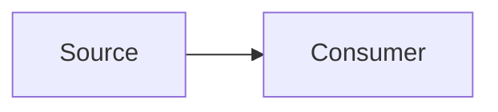

# Documentation style guide

**Status:** Canonical rules for repository documentation.

## Principles

1. Lead with the reader's task or the system outcome.
2. Keep rules, current implementation, future proposals, and historical context visibly separate.
3. Link to source-of-truth code rather than copying large code bodies.
4. Use diagrams only when relationships or sequences are clearer than prose.
5. State mode/platform differences explicitly.
6. Never claim a theoretical result, performance number, deployment provider, or security property without evidence.

## Location

| Document kind | Location |
|---|---|
| Cross-project canonical docs | `docs/<section>/` |
| Detailed stable manuals | `docs/` |
| Platform implementation workbook | next to that platform, linked from `docs/platforms/` |
| Package-specific short usage | package README if one exists |
| Historical material | clearly labeled and linked only for provenance |

Add every canonical document to `docs/README.md`.

## Structure

Each canonical document should have:

- one H1 matching its topic;
- an optional status line;
- a short scope paragraph;
- task-oriented H2 sections;
- links to related documents; and
- clear current/future distinctions.

Use sentence-case headings. Prefer tables for exact mappings and Mermaid for architecture/sequence/state relationships.

## Mermaid

GitHub renders Mermaid fences directly:

````markdown

````

Guidelines:

- keep node labels short;
- avoid decorative diagrams;
- use `sequenceDiagram` for calls over time;
- use `flowchart` for responsibility/data movement;
- use `stateDiagram-v2` for lifecycle states;
- use `erDiagram` for persisted relationships; and
- explain important caveats in prose because diagrams are summaries.

## Code and paths

- Use fenced blocks with a language where known.
- Use backticks for paths, functions, fields, commands, statuses, and piece characters.
- Keep examples free of real keys, tokens, user IDs, or production-only values.
- Do not paste generated engine bundles or lockfile fragments into docs.

## Current versus planned

Use direct labels:

- **Current behavior:** what the checked-in implementation does.
- **Known limitation:** a verified gap.
- **Proposed:** a design not yet implemented.
- **Historical:** retained context that should not guide new work.

Avoid writing planned behavior in present tense.

## Updating documentation

| Code change | Documentation to inspect |
|---|---|
| Rule or encoding | game rules, game engine, game theory, iOS bridge |
| Search/evaluation | AI engine, game theory, platform worker/bridge |
| API contract | API reference, platform API, runtime flows, clients |
| Schema/RLS/Realtime | database, data and Realtime, security/operations |
| Package dependency | monorepo architecture, root README |
| New route/store/screen | platform guide and docs hub if user-facing |
| CI/deploy | contributing, GitHub setup, operations |

## Validation

Run:

```bash
pnpm docs:check
```

The check validates case-sensitive local Markdown links, heading structure, and
balanced/non-empty Mermaid fences with recognized diagram headers. It does not
prove that a diagram is semantically correct, so review changed diagrams in a
GitHub-compatible renderer.

Also run `git diff --check` before committing.
